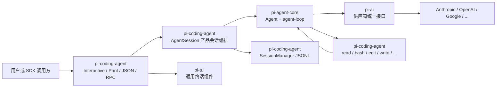
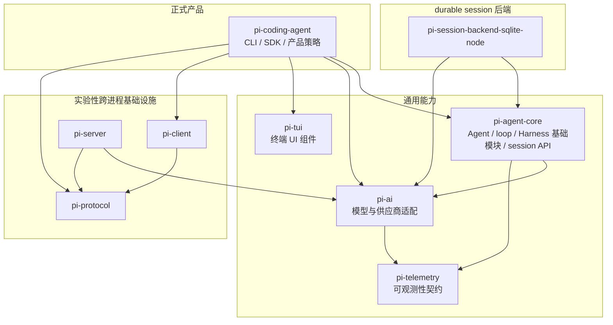
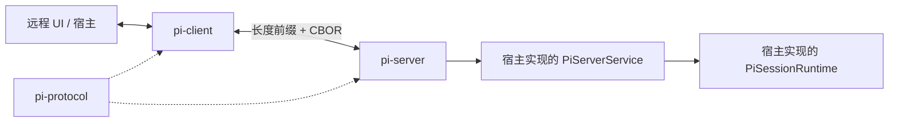

# 架构总览

## 1. 正式产品路径

正式发布的 `pi` CLI 从 `packages/coding-agent/src/cli.ts` 进入 `main.ts`，最终创建 `AgentSession`。`AgentSession` 是连接模型、工具、扩展、设置和会话历史的产品会话。交互、打印、JSON 和 RPC 模式只是同一运行时的不同输入输出方式。一次本地请求的运行关系如下：



这条链路中各包的职责是：

- `pi-ai` 解决“怎样以统一接口调用不同模型供应商”。
- `pi-agent-core` 的 `Agent` 和 agent loop 解决“何时调用模型、怎样执行工具、何时结束”。
- `pi-coding-agent` 解决“怎样把通用能力组成可直接使用的编码 Agent 产品”。
- `pi-tui` 提供终端布局、输入、组件和渲染，不理解 Agent 语义。
- `pi-telemetry` 定义可观测性接口和事件 schema，不是模型接口，也不参与业务决策。

`pi-coding-agent` 与 `pi-agent-core` 的组合关系： coding-agent 创建 `Agent`，再加入编码工具、system prompt、配置、扩展、skills、会话持久化和运行模式。

## 2. 包地图

下图表示 package manifest 依赖，不表示一次请求会经过所有包：



| 包 | 提供什么 | 不提供什么 |
|---|---|---|
| `pi-coding-agent` | 完整编码 Agent 的 CLI、进程内 SDK、配置、工具、扩展、会话和 UI 编排 | 不实现供应商协议或通用终端渲染 |
| `pi-agent-core` | `Agent`、agent loop、durable session API、Harness 基础模块和通用工具接口 | 当前 `AgentHarness` 外壳尚不能执行完整 run |
| `pi-ai` | 模型目录、鉴权、统一消息/流事件和供应商适配 | 不决定何时调用工具 |
| `pi-tui` | 编辑器、布局、滚动、按键、Markdown 和差量渲染 | 不理解模型、Agent 或会话 |
| `pi-telemetry` | 无供应商绑定的 span、事件和属性契约 | 不负责模型调用或日志存储 |
| `pi-protocol` | 跨进程 schema、CBOR 编解码和长度分帧 | 不建立连接，不运行 Agent |
| `pi-client` | 连接、请求关联、会话句柄和本地 snapshot（用于恢复的完整状态快照） | 不执行 Agent loop |
| `pi-server` | 连接接入、会话租约、命令分发和 snapshot/progress 广播 | 不内置具体 Agent runtime |
| `pi-session-backend-sqlite-node` | durable session API 的 SQLite `SessionRepo`/`SessionStorage` 实现 | 不替代正式 CLI 的 `SessionManager` |

## 3. 正式运行时与 Harness 工程

当前源码里只有一个 `AgentHarness`，但它尚不是可与 `AgentSession` 并列使用的完整运行时。`AgentSession` 是正式产品运行时；agent-core 已实现 durable session、compaction、工具和类型等 Harness 基础模块，而 `AgentHarness` 类仍是未完成外壳。它们不是 `Agent → AgentHarness → AgentSession` 的线性分层：

| 维度 | 正式产品运行时 | Harness 工程 |
|---|---|---|
| 核心类型 | `pi-coding-agent` 的 `AgentSession` | `pi-agent-core` 的 session/compaction/tool 模块及 `AgentHarness` 外壳 |
| 当前入口 | 正式 CLI、进程内 SDK、print/JSON/RPC | 基础模块可单独使用；Harness 执行入口未完成 |
| 会话 | `SessionManager` 产品 JSONL | durable `Session` + `SessionRepo`/`SessionStorage` |
| 压缩 | `packages/coding-agent/src/core/compaction/` | `packages/agent/src/harness/compaction/` |
| 能力状态 | 配置、扩展、完整命令和 TUI 生命周期均已接入 | session 后端等模块已实现；Harness run、恢复、队列、lane（指向某条会话分支末端的命名指针）和 watch 等仍未实现 |
| 正式 CLI 是否使用 | 是 | 否 |

压缩本身是通用 Agent 能力。coding-agent 的压缩已经接入正式 `AgentSession`；agent-core 的压缩是 Harness 工程中的可复用基础模块，但完整 Harness 调度尚未接通。

`AgentHarness.prompt()`、`compact()`、`resume()`、队列、lane 和 watch 等操作当前明确返回 `HarnessNotImplemented`，带已有 record 的恢复创建也会拒绝。 `agent/docs/harness.md` 是实现规格，包含 Future、build order 和 open questions，不能整体当作现状。

Harness 的目标规格主要解决长生命周期 Agent 的持久化与中断恢复问题；其执行环境、状态提交、工具重放和存储边界设计见 [AgentHarness：当前实现与目标规格](./package-docs/01-agent-harness-status-and-design.md)。

### 3.1 具体实现

想确认两者的区别，可以分别看[正式运行时怎样启动](./02-runtime-and-request-flow.md#11-具体实现)，以及 [`AgentSession` 与 `AgentHarness` 的实现对比](./03-agent-core.md#31-具体实现)。

## 4. 跨进程组件是什么

protocol/client/server 不是另一种 Agent，也不是远程桌面。它们是一套让 UI 或宿主通过进程边界控制“某个会话运行时”的基础设施：



`pi-server` 只调用宿主注入的 `PiServerService`/`PiSessionRuntime`，并不知道内部是 coding agent、其他 Agent，还是测试 runtime。当前仓库没有把 `AgentSession` 或 `AgentHarness` 接成完整 `PiServerService` 的正式实现。

client/server 的意义是分离调用方与运行时的进程和生命周期。例如 IDE 关闭后，容器中的 Agent 服务仍可继续；IDE 重连后通过 snapshot 恢复状态。若应用和 Agent 在同一进程且生命周期一致，直接使用 `pi-coding-agent` SDK 更简单。详细协议见[跨进程协议与工程治理](./07-remote-protocol-and-engineering.md)。

### CBOR 是什么

CBOR（Concise Binary Object Representation）是把对象、数组、字符串、数字、布尔值、`null` 和字节数组编码成二进制的格式，作用类似“二进制 JSON”。Pi 的发送边界是：

```text
JavaScript 对象
  → schema 校验字段
  → CBOR 编码为字节
  → 长度前缀标出一条消息的边界
  → Unix socket 等字节传输
```

CBOR 只负责值与字节之间的转换；`pi-protocol` 的 schema 定义命令含义，长度前缀负责从连续字节流中切分消息，transport 负责传输。

### 4.1 具体实现

如果你关心远程宿主或进程间通信，可以接着看[跨进程协议的具体实现](./07-remote-protocol-and-engineering.md#51-具体实现)。

## 5. 当前实现体现的设计原则

### 5.1 事件流是运行边界

模型响应、工具进度、Agent 生命周期和 UI 更新都以事件表达。`start → delta → done/error` 使实时显示、中止、工具并行、持久化和遥测可以观察同一条有序事实流。

### 5.2 追加历史与派生上下文

会话保存事实历史；发送给模型的上下文是从活动分支和最近压缩结果计算出的视图。压缩生成摘要，不等于删除磁盘历史。正式产品 `SessionManager` 和 durable session API 都遵循这一大方向，但格式和实现彼此独立。

### 5.3 通用循环与产品策略分开

`pi-agent-core` 只决定模型、工具、队列和事件怎样循环；`pi-coding-agent` 决定使用哪些工具、怎样加载项目资源、何时压缩、怎样持久化以及如何显示。这让同一个 `Agent` 可用于其他宿主，也避免 provider 和终端逻辑进入循环核心。

### 5.4 扩展发生在明确边界

Pi 允许 extension 在输入、模型请求、工具执行、compaction 和 session 生命周期的固定位置观察或替换行为，而不是要求所有定制都修改核心代码。代价是这些 hook 的顺序、错误处理和 session 切换语义必须保持稳定；扩展也是受信任代码，不是权限沙箱。

### 5.5 供应商差异保留在适配层

公共层统一消息和流式事件，但不假设所有 provider 行为相同。模型的兼容信息描述工具、thinking、cache 和 session affinity 等能力，具体网络字段留在 API adapter。这里选择的是统一上层控制流，同时保留供应商差异，而不是追求功能最少的统一接口。

### 5.6 具体实现

想从源码确认这些原则，可以分别看 [Agent loop](./03-agent-core.md#25-具体实现)、[上下文压缩](./04-session-and-persistence.md#36-具体实现)、[Extension 的产品取舍](./06-extension-resource-tui.md#81-具体实现)和[供应商流适配](./05-ai-provider-layer.md#31-具体实现)。
