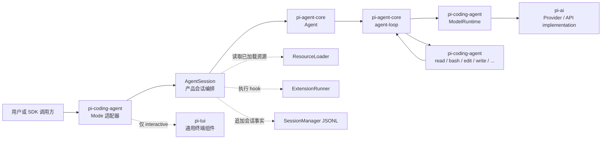
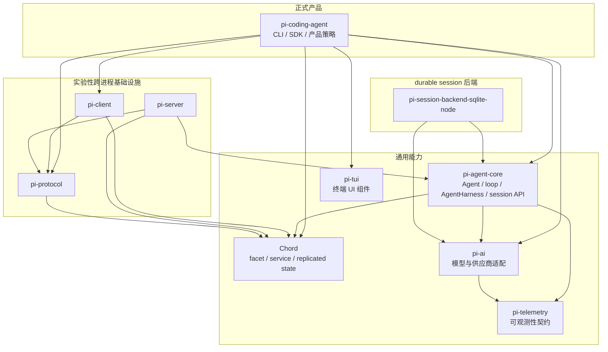
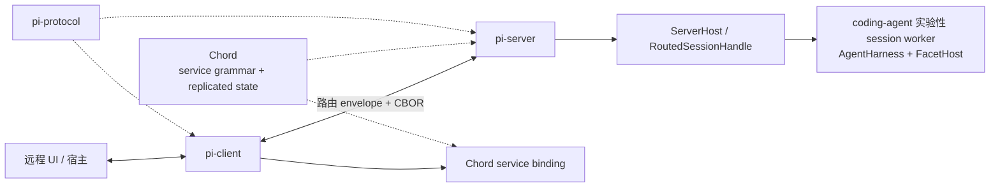

# 架构总览

## 1. 正式产品路径

正式发布的 `pi` CLI 从 `packages/coding-agent/src/cli.ts` 进入 `main.ts`，最终创建 `AgentSession`。`AgentSession` 是连接模型、工具、扩展、设置和会话历史的产品会话。交互、打印、JSON 和 RPC 模式只是同一运行时的不同输入输出方式。下图的实线是主请求路径，虚线是 `AgentSession` 的产品依赖或旁路输出：



这条链路中各包的职责是：

- `pi-ai` 解决“怎样以统一接口调用不同模型供应商”。
- `pi-agent-core` 的 `Agent` 和 agent loop 解决“何时调用模型、怎样执行工具、何时结束”。
- `pi-coding-agent` 解决“怎样把通用能力组成可直接使用的编码 Agent 产品”。
- `pi-tui` 提供终端布局、输入、组件和渲染，不理解 Agent 语义。
- `pi-telemetry` 定义可观测性接口和事件 schema，不是模型接口，也不参与业务决策。

`pi-coding-agent` 与 `pi-agent-core` 的组合关系： coding-agent 创建 `Agent`，再加入编码工具、system prompt、配置、扩展、skills、会话持久化和运行模式。

## 2. 包地图

下图表示 package manifest 依赖，不表示一次请求会经过所有包：



> **术语说明：Chord** 是模块协作与状态同步框架。**facet** 是有启动、销毁等生命周期的功能模块；**service** 是模块向外提供的能力接口；**replicated state** 是调用方持有的状态同步副本；**Delta** 是描述状态变化的增量。例如，远程界面通过 `AgentController` 控制 Agent，再订阅 `Transcript` 的会话状态：先取得完整快照，随后接收增量更新并刷新显示。Chord 负责服务调用与状态同步的语义，protocol/client/server 负责跨进程路由和传输。Chord 也可用于同一进程内的模块组合。详见 [Chord 架构专题](./package-docs/09-chord-facets-services-and-delta.md)。

| 包 | 提供什么 | 不提供什么 |
|---|---|---|
| `pi-coding-agent` | 完整编码 Agent 的 CLI、进程内 SDK、配置、工具、扩展、会话和 UI 编排 | 不实现供应商协议或通用终端渲染 |
| `chord` | facet 生命周期、typed service、replicated state、Delta 和远程 service 语义 | 不规定 Pi 协议、Agent 或具体 transport |
| `pi-agent-core` | `Agent`、agent loop、可恢复 `AgentHarness`、durable session API 和通用工具接口 | 不提供 coding-agent 的旧产品扩展与 TUI |
| `pi-ai` | 模型目录、鉴权、统一消息/流事件和供应商适配 | 不决定何时调用工具 |
| `pi-tui` | 编辑器、布局、滚动、按键、Markdown 和差量渲染 | 不理解模型、Agent 或会话 |
| `pi-telemetry` | 无供应商绑定的 span、事件和属性契约 | 不负责模型调用或日志存储 |
| `pi-protocol` | 路由 envelope、strict-JSON 校验、CBOR 编解码和长度分帧 | 不解释 Chord service payload，不建立连接 |
| `pi-client` | 连接、请求关联、取消、attachment 路由和 Chord transport 适配 | 不定义应用 service，也不自动重放请求 |
| `pi-server` | 连接接入、session attachment 路由和 Chord service 调用转发 | 不内置模型或工具策略 |
| `pi-session-backend-sqlite-node` | durable session API 的 SQLite `SessionRepo`/`Storage` 实现 | 不替代正式 CLI 的 `SessionManager` |

## 3. 正式运行时与 Harness 工程

`AgentSession` 与 `AgentHarness` 现在都是可运行的会话编排器，但服务不同路径。正式 CLI/SDK 仍使用前者；后者已实现 durable operation 驱动，并被 coding-agent 的实验性 session worker 接入。它们不是 `Agent → AgentHarness → AgentSession` 的线性分层：

| 维度 | 正式产品运行时 | Harness 工程 |
|---|---|---|
| 核心类型 | `pi-coding-agent` 的 `AgentSession` | `pi-agent-core` 的 `AgentHarness` / `AgentLane` |
| 当前入口 | 正式 CLI、进程内 SDK、print/JSON/RPC | 自定义宿主；coding-agent 实验性 server/session worker/client |
| 会话 | `SessionManager` 产品 JSONL | durable `Session` + `SessionRepo`/`Storage` |
| 压缩 | `packages/coding-agent/src/core/compaction/` | `packages/agent/src/harness/compaction/` |
| 能力状态 | 配置、旧 extension、完整命令和 TUI 生命周期均已接入 | run/恢复、compaction、navigation、队列、lane watch 和工具 durable checkpoint 已实现；`watchSession()` 目前只有接口，尚不能订阅整个会话的状态变化 |
| 默认正式 CLI 是否使用 | 是 | 否；仅实验入口使用 |

Harness 将一次 run/compaction/navigation 表示为 durable operation。`AgentLane.accept()` 原子接纳操作，`drive()` 解释持久状态并执行下一步；模型帧、工具参数/输出、retry wait 和 terminal result 都在明确 checkpoint 落盘。进程中断后 `resume()` 从 operation state 继续，而不是从聊天文本猜测进度。它仍不承诺 exactly-once：不可安全重放的外部工具在不确定窗口内会合成 interrupted result。

`agent/docs/harness.md` 现在是规范与实现状态的共同来源；其中明确列出的剩余切片包括 session 级 watch、JSONL 物理压缩、search 以及未来格式迁移。当前实现和边界见 [AgentHarness：durable runtime 与剩余切片](./package-docs/01-agent-harness-status-and-design.md)。

### 3.1 具体实现

想确认两者的区别，可以分别看[正式运行时怎样启动](./02-runtime-bootstrap.md#11-具体实现)，以及 [`AgentSession` 与 `AgentHarness` 的实现对比](./05-agent-session-and-execution.md#41-具体实现)。

## 4. 跨进程组件是什么

跨进程组件让界面或其他应用能够调用另一个进程中的 Agent，并持续接收会话状态更新。可以按三层理解：**pi-protocol 定义通信外壳，Chord 定义服务与状态同步机制，coding-agent 定义具体业务服务。**

| 层 | 解决的问题 | 具体职责 |
|---|---|---|
| `pi-protocol` | client 和 server 之间的消息怎么包装？ | 定义请求编号、目标会话、请求／响应类型等外层消息格式，以及编码和分帧 |
| Chord | 模块怎样提供服务，调用方怎样获得状态变化？ | 定义模块如何暴露服务、服务如何被发现和调用，以及状态快照和增量更新的订阅机制 |
| coding-agent | 提供哪些 Agent 业务能力？ | 定义 `AgentController`、`Transcript`、`Models` 等具体服务，并在实验性会话 worker 中接入 `AgentHarness` |

`pi-client` 和 `pi-server` 负责连接与路由，将消息送到正确的会话 worker，并把响应和状态更新送回调用方。coding-agent 则通过多个功能模块提供服务：例如 `AgentController` 提供控制能力，`Transcript` 提供会话内容，`Models` 提供模型相关能力。

以“界面发消息给 Agent，然后显示回答”为例：

1. 界面调用 coding-agent 定义的 `AgentController` 服务。
2. Chord 将操作表示为服务调用，`pi-protocol` 定义承载这个调用的外层消息格式；client/server 将消息送到对应 worker。
3. worker 中的服务实现操作 `AgentHarness`，Agent 开始运行，会话内容随之变化。
4. 界面通过 Chord 订阅 `Transcript` 状态，先取得完整快照，随后接收增量更新并刷新显示。这些更新同样经过 protocol/client/server 传回界面。

下图展示这些组件的连接关系：



`pi-protocol` 只理解 hello、request/response/cancel、service update 和 attachment change 等外层 envelope。payload 中的 service catalogue、调用、订阅 snapshot/update 与错误码由 Chord 定义；具体 `SessionDirectory`、`AgentController`、`Transcript` 和 `Models` 则由 coding-agent 的实验性 facets 定义。

coding-agent 已提供实验性 server、client、coordinator 和每会话 worker：server 负责路由，worker 持有 durable `Session`、`AgentHarness` 和 session facets，presentation 通过 Chord replicated state 获得 transcript。它仍不属于默认 CLI/SDK 稳定路径。若应用和 Agent 在同一进程且生命周期一致，直接使用正式 SDK 更简单。详细协议见[跨进程协议与工程治理](./08-remote-protocol-and-engineering.md)。

### CBOR 是什么

CBOR（Concise Binary Object Representation）是把对象、数组、字符串、数字、布尔值、`null` 和字节数组编码成二进制的格式，作用类似“二进制 JSON”。Pi 的发送边界是：

```text
JavaScript envelope + strict-JSON payload
  → protocol 校验外层路由字段
  → Chord adapter 校验 service 语义
  → CBOR 编码为字节
  → 长度前缀标出一条消息的边界
  → Unix socket 等字节传输
```

CBOR 只负责值与字节之间的转换；`pi-protocol` 定义路由和关联语义，Chord 定义 payload 中的 service 语义，长度前缀负责从连续字节流中切分消息，transport 负责传输。

### 4.1 具体实现

如果你关心远程宿主或进程间通信，可以接着看[跨进程协议的具体实现](./08-remote-protocol-and-engineering.md#51-具体实现)。

## 5. 当前实现体现的设计原则

### 5.1 事件流是运行边界

模型响应、工具进度、Agent 生命周期和 UI 更新都以事件表达。`start → delta → done/error` 使实时显示、中止、工具并行、持久化和遥测可以观察同一条有序事实流。

### 5.2 追加历史与派生上下文

会话保存事实历史；发送给模型的上下文是从活动分支和最近压缩结果计算出的视图。压缩生成摘要，不等于删除磁盘历史。正式产品 `SessionManager` 和 durable session API 都遵循这一大方向，但格式和实现彼此独立。

### 5.3 通用循环与产品策略分开

`pi-agent-core` 只决定模型、工具、队列和事件怎样循环；`pi-coding-agent` 决定使用哪些工具、怎样加载项目资源、何时压缩、怎样持久化以及如何显示。这让同一个 `Agent` 可用于其他宿主，也避免 provider 和终端逻辑进入循环核心。

### 5.4 扩展发生在明确边界

Pi 允许 extension 在输入、模型请求、工具执行、compaction 和 session 生命周期的固定位置观察或替换行为，而不是要求所有定制都修改核心代码。代价是这些 hook 的顺序、错误处理和 session 切换语义必须保持稳定；扩展也是受信任代码，不是权限沙箱。

### 5.5 供应商差异保留在适配层

公共层统一消息和流式事件，但不假设所有 provider 行为相同。模型的兼容信息描述工具、thinking、cache 和 session affinity 等能力，具体网络字段留在 API adapter。这里选择的是统一上层控制流，同时保留供应商差异，而不是追求功能最少的统一接口。

### 5.6 组合图与传输协议分开

Chord 决定 facet 怎样组合、service 怎样被发现和替换、状态怎样复制；`pi-protocol` 只决定这些 opaque service 值如何带着 server/session/attachment route 跨越字节流。coding-agent 再定义具体服务和进程生命周期。这样插件能力可以增加而不扩张底层协议命令表，transport 也无需理解 Agent 语义。

### 5.7 具体实现

想从源码确认这些原则，可以分别看 [Agent loop](./05-agent-session-and-execution.md#35-具体实现)、[上下文压缩](./06-session-and-persistence.md#36-具体实现)、[Extension 的产品取舍](./04-resources-and-extensions.md#51-具体实现)、[供应商流适配](./03-model-and-auth-runtime.md#31-具体实现)和 [Chord 架构专题](./package-docs/09-chord-facets-services-and-delta.md)。
