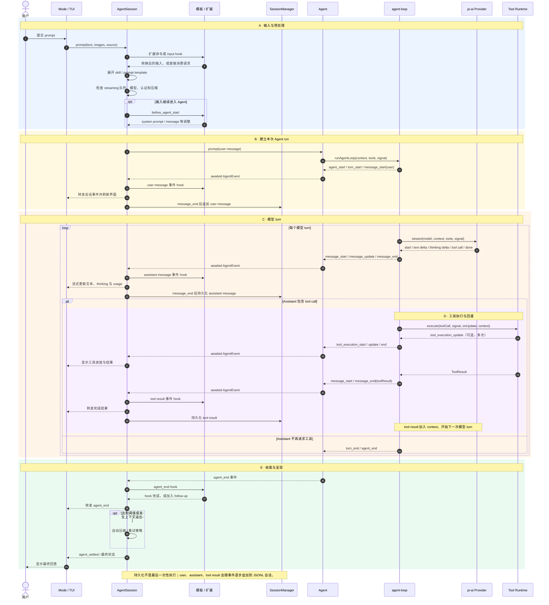

# 启动与运行时编排

## 1. 启动阶段

`packages/coding-agent/src/cli.ts` 是极薄入口：设置进程标识、预配置 HTTP dispatcher，然后调用 `main(argv)`。`main.ts` 是应用级组装入口，也就是创建主要对象并把它们连接起来的位置：

1. 解析 CLI、stdin 和文件参数。
2. 解析运行模式：`interactive`、`print`、`json` 或 `rpc`。
3. 处理无需完整运行时的 help、auth、list-models、config/package 命令。
4. 建立项目信任上下文，加载 global/project settings。
5. 创建 `ModelRuntime`、`ResourceLoader` 和 `SessionManager`。
6. 解析模型、thinking level、工具白名单和 session 恢复策略。
7. 通过 `createAgentSessionServices()` 与 `createAgentSessionFromServices()` 创建 `AgentSession`。
8. 包装为 `AgentSessionRuntime`，交给具体 mode。

`createAgentSessionServices()` 刻意与创建 session 分开。原因是 cwd 变化会影响 settings、资源、工具路径和模型配置；会话切换时必须先按新 cwd 重建这些服务，再解析 session 选项。

本章保留总体时序。需要逐函数追踪初始化、替换、请求、资源重载、Provider 请求和 TUI 渲染时，转到[核心调用链](./call-flows/README.md)。

### 1.1 具体实现

按启动时对象出现的顺序阅读：

1. [`cli.ts`](../packages/coding-agent/src/cli.ts)：确认极薄进程入口怎样调用 `main()`。
2. [`main.ts`](../packages/coding-agent/src/main.ts)：只跟踪 `appMode`、`settingsManager`、`modelRuntime`、`sessionManager` 和 `runtime` 的创建与传递。
3. [`agent-session-services.ts`](../packages/coding-agent/src/core/agent-session-services.ts)：确认这些依赖为何要先于 session 创建。
4. `agent-session-runtime.ts`：它负责替换整组服务，具体切换顺序见本章 4.1。
5. [`sdk.ts`](../packages/coding-agent/src/core/sdk.ts)：对照 SDK 怎样复用相同组装路径。

## 2. 一次请求的完整路径

这张图只描述正式本地请求。protocol/client/server 不在这条调用链中。实线表示调用或提交，虚线表示返回值或事件；一个 turn 是一次模型响应及其工具结果，同一请求可能经过多个 turn，直到模型不再请求工具。

### 怎样读这张图

- `Mode / TUI` 是表现层：交互模式、print、JSON 和 RPC 都把请求交给同一个 `AgentSession`。
- `Agent` 保存运行状态，并拥有 steer/follow-up 核心队列；`agent-loop` 执行模型—工具循环和队列投递；`pi-ai Provider` 处理具体供应商协议。
- 当前 coding-agent 的 `AgentSession` 在这些通用能力外处理输入展开、扩展、设置同步、UI 队列镜像、产品 JSONL 持久化，以及自动压缩/重试的触发与呈现。压缩和队列不是 coding-agent 独有能力；这里只描述正式产品的实际接入路径。
- 工具调用不会创建新的用户请求。工具结果被加入同一个 Agent run 的上下文，随后开始下一个模型 turn。
- `SessionManager` 在 `message_end` 等事件到达时逐步追加 JSONL，不是等整次请求结束后一次性保存。

关键点是 `Agent` 的事件监听器会被 await。`agent_end` 表示循环不再产生新事件，但只有所有监听器完成、运行态清理后，`waitForIdle()` 才真正完成。因此持久化或扩展 hook 可以在“对外宣告 idle”前完成一致性工作。

### 2.1 具体实现

按一次请求向下调用、再由事件返回的顺序阅读：

要把时序图和源码对应起来，可以先沿这四个调用点走一遍：

1. 在 `agent-session.ts` 看 `prompt()`，确认输入 hook、模板展开、队列、认证和压缩检查的先后关系。
2. 接着看 `agent.ts` 的 `prompt()` 和 `runWithLifecycle()`，确认 active run 怎样建立。
3. 再看 `agent-loop.ts` 的 `runLoop()` 与 `streamAssistantResponse()`，确认模型—工具循环的调用方向。下一章的[具体实现](./03-agent-core.md#25-具体实现)会给出这两个核心文件的链接和内部顺序。
4. 最后看 `agent-session.ts` 的 `_handleAgentEvent()`，确认事件怎样经过扩展、UI/SDK 监听器并写入会话。

## 3. 输入预处理与队列

`AgentSession.prompt()` 并不直接把字符串传给模型。正常顺序是：

- 扩展命令：立即执行，甚至可在模型流式响应期间运行。
- 扩展 input hook：允许变换或消费输入。
- skill command 和文件 prompt template：在 input hook 之后展开为真实提示。
- streaming 状态：若已有请求运行，要求调用方明确选择 `steer` 或 `followUp`，然后进入队列。
- 非 streaming 状态：检查模型、认证和是否需要预先压缩，再构造包含图片的 user message。
- `before_agent_start` hook：最后允许扩展加入 custom message 或调整本次 system prompt。

steering 在当前 assistant turn 的工具调用结束后注入，follow-up 在 Agent 原本将要停止时注入。核心队列和投递时机由 `Agent`/`agent-loop` 实现，并支持 `one-at-a-time` 和 `all`；`AgentSession` 展开输入、从设置同步模式并维护供 UI 展示的队列镜像。这个区分解决了“纠正正在进行的工作”和“追加下一项工作”语义不同的问题。

### 3.1 具体实现

队列逻辑就在[前面的请求链](#21-具体实现)里，分别关注三个局部：

1. `agent-session.ts` 的 `_queueSteer()` 和 `_queueFollowUp()`：产品层怎样维护 UI 队列镜像。
2. `agent.ts` 的 `PendingMessageQueue`：核心队列怎样保存和取出消息。
3. `agent-loop.ts` 的两层 `while`：steering 与 follow-up 分别在哪个边界插入。

## 4. 会话替换生命周期

`AgentSession` 代表一个稳定会话；`AgentSessionRuntime` 代表“当前活动会话及其 cwd 绑定服务”。`/new`、resume、fork、clone 和 import 都属于后者。切换顺序是：

1. 发出可取消的 `session_before_switch`/`session_before_fork`。
2. abort 当前响应并等待工具结果等落盘。
3. 发 `session_shutdown`。
4. 同步解绑宿主 UI，dispose 旧 session。
5. 按目标 cwd 创建 settings/model/resource 服务。
6. 创建新 session 并发 `session_start`。
7. UI 重新订阅并绑定扩展。

这个顺序用于避免两类具体错误：旧扩展组件在新 session 中继续接收事件，以及跨 cwd 恢复时错误复用原目录的设置或资源。

### 4.1 具体实现

1. 读 [`agent-session-runtime.ts`](../packages/coding-agent/src/core/agent-session-runtime.ts) 的 switch、fork 和 new 操作，确认替换过程的总顺序。
2. 接着看 `agent-session.ts` 的 `createReplacedSessionContext()`，确认新 cwd 下哪些依赖必须重建。
3. 读 [`interactive-mode.ts`](../packages/coding-agent/src/modes/interactive/interactive-mode.ts) 的 rebind 逻辑，确认 UI 怎样解绑旧 session、订阅新 session。

## 5. 多种 mode 共用正式 coding-agent runtime

- Interactive mode 将事件映射到 TUI 组件，并提供完整命令、overlay 和编辑器。
- Print mode 订阅同一事件流，只输出文本或 JSONL，然后退出。
- RPC mode 把 stdin/stdout 变成控制协议，适合外部进程托管。
- protocol/client/server 是独立的跨进程基础设施。当前正式入口没有把它们接到 `AgentSession`。

interactive、print、JSON 和 RPC 不是四套 Agent，而是同一个 `AgentSession` 上的四种表现或传输方式。client/server 不是第五个 mode，也不是另一种 Agent。
