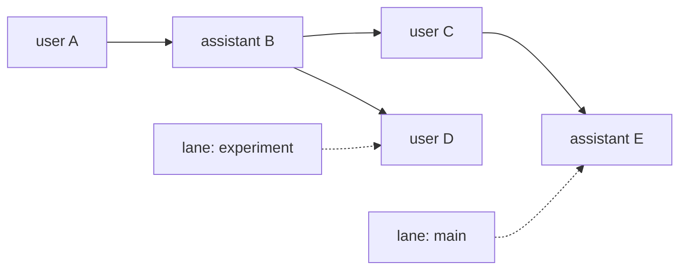

# 会话、上下文压缩与持久化

当前仓库有两个会话子系统。它们概念相似，但类型、文件格式、压缩实现和入口不同。先分清它们，再看细节。

| 子系统 | 使用者 | 核心类型 | 存储 |
|---|---|---|---|
| coding-agent 产品会话 | 正式 CLI/SDK 的 `AgentSession` | `SessionManager` | coding-agent JSONL |
| agent-core durable session | Harness 工程和自定义宿主 | `Session`、`SessionRepo`、`SessionStorage` | JSONL、内存、SQLite |

## 1. 正式产品会话

`packages/coding-agent/src/core/session-manager.ts` 负责正式产品的会话历史、resume、fork、clone、导航和 JSONL 文件。`AgentSession` 订阅 `Agent` 事件，在 user、assistant 和 tool result 完成时逐步追加记录，不是等整个请求结束后一次性保存。

正式产品的压缩位于 `packages/coding-agent/src/core/compaction/`。它根据 coding-agent 的 session entry 和产品设置生成摘要，由 `AgentSession` 决定手动压缩、阈值压缩和 overflow recovery 的触发与 UI 事件。压缩是通用问题，但这里是正式产品当前使用的具体实现。

## 2. 正式产品怎样生成模型上下文

context（上下文）是下一次请求实际交给模型的 system prompt、消息和工具定义。磁盘 session 由 entry 组成；entry 是每次追加的一条消息、模型变更、压缩或其他会话记录，并通过 `parentId` 形成树。leaf 是当前活动分支最末端的 entry。`SessionManager.buildSessionContext()` 只从当前 leaf 所在分支生成本次需要的消息。

没有压缩时，它沿每条 entry 的 `parentId` 从当前 leaf 回到根，再恢复为正序消息。有压缩时，它使用：

```text
最新 compaction entry 中的 summary
  + firstKeptEntryId 开始的近期原始 entry
  + compaction entry 之后新产生的 entry
```

因此 session history、活动分支和模型 context 是三份相关但不同的视图。压缩改变 context 的生成方式，不删除历史。

## 3. 正式产品的 compaction 算法

compaction（上下文压缩）把较早消息总结成摘要，并保留近期原始消息。默认设置预留 16,384 token 给提示和下一次模型输出，并尝试保留最近 20,000 token 的原始消息；用户设置可以覆盖这两个值。

### 3.1 何时触发

有三条入口：

- manual：用户明确调用压缩。
- threshold：估计的 context token 大于 `contextWindow - reserveTokens`。
- overflow：供应商报告上下文溢出，或响应因可恢复的长度限制被截断。

token 估算优先使用最近一次有效 assistant usage，因为它是供应商对真实请求的计数；最后一次 usage 后新增的消息用字符数近似补上。如果没有有效 usage，所有消息都用估算。压缩后会拒绝使用压缩前的旧 usage 再次触发压缩，避免刚压缩完立刻重复执行。

### 3.2 怎样选择切分点

`prepareCompaction()` 先找到最近一次 compaction 边界，然后 `findCutPoint()` 从最新 entry 向前累计估算 token，直到达到 `keepRecentTokens`。

切分不能落在 `toolResult` 上，因为工具结果必须跟在产生它的 assistant tool call 后面。允许从 assistant entry 开始保留；如果这会切开一个 turn，Pi 额外找到该 turn 的 user 起点，并把被切掉的 turn 前半部分单独总结。这样既能保留大型工具调用后的近期结果，也不会让保留部分失去原始任务背景。

准备结果明确分成：

- `messagesToSummarize`：较早历史，将进入主摘要。
- `turnPrefixMessages`：被切开 turn 的前半段，将进入 turn-prefix 摘要。
- `firstKeptEntryId`：近期原始消息从哪里开始保留。
- `previousSummary`：上一次压缩摘要，用于增量更新而不是遗忘旧摘要。
- `fileOps`：从工具调用提取的已读和已修改文件，附在摘要中保留工作状态。

### 3.3 怎样生成和落盘

默认实现用当前模型发起独立总结请求。总结请求禁用 prompt cache，因为它是一次性输入，不值得写入供应商缓存；瞬时网络错误仍使用独立 retry 策略。若模型以 `length` 结束、返回 error 或试图调用工具，摘要不会保存。

成功后，`AgentSession` 追加一个 compaction entry，其中保存 summary、`firstKeptEntryId`、压缩前 token 数、usage 和文件操作信息。随后它重新调用 `buildSessionContext()` 并替换 `Agent.state.messages`。原 entry 仍在 JSONL 中，所以导出、树浏览和再次分支仍能看到完整历史。

### 3.4 overflow 怎样恢复

若本次 assistant 因 overflow 或可恢复的长度限制失败，错误消息已经随 `message_end` 写入 session history。恢复时 Pi：

1. 从当前 Agent context 临时移除失败的 assistant message。
2. 执行 compaction 并重建 context。
3. 再次移除可能被重建带回的失败消息。
4. 调用 `agent.continue()` 重试被中断的 turn。

自动恢复最多尝试一次，防止“压缩—重试—再次溢出”无限循环。若 response 已成功结束但实际 context 已超限，只压缩供下一次使用，不重试已经完成的回答。

### 3.5 扩展可以改变什么

`session_before_compact` hook 可以取消本次压缩，或直接提供自定义 compaction result；默认算法只在扩展没有接管时运行。成功后发 `session_compact`，失败后发 `session_compact_failed`。这说明 compaction 是核心产品策略，但摘要内容仍是可替换的扩展点。

### 3.6 具体实现

按“生成上下文—判断是否压缩—执行压缩—重建上下文”的顺序阅读：

这条实现链横跨会话投影、触发判断和摘要算法，按下面的方法顺序看即可：

1. 在 [`session-manager.ts`](../packages/coding-agent/src/core/session-manager.ts) 定位 `buildContextEntries()`：确认活动分支怎样投影成模型消息。
2. 在 [`agent-session.ts`](../packages/coding-agent/src/core/agent-session.ts) 定位 `_checkCompaction()`：确认 manual、threshold 和 overflow 三种触发语义。
3. [`compaction.ts`](../packages/coding-agent/src/core/compaction/compaction.ts) 的 `estimateContextTokens()`、`findCutPoint()` 和 `prepareCompaction()`：确认 token 估算与切分不变量。
4. 继续读同一文件的 `compact()` 与 `completeSummarization()`：确认摘要请求、失败条件和结果结构。
5. 回到同一个 `agent-session.ts` 定位 `_runAutoCompaction()`：确认 compaction entry 落盘、context 替换和 overflow 重试。

## 4. Durable session 模型

`packages/agent/src/harness/session` 把会话定义为追加式日志，包含四类 mutation：

- entry：有 `id`、`parentId`、`seq` 的历史节点。
- record：operation start/finish、usage 等不直接进入模型上下文的运行记录。
- lane：命名指针，指向 entry 树的某个叶子；默认 lane 是 `main`。
- fact：会话名称、节点标签等可更新事实。

这里拆成两个接口，不是为了抽象而抽象，而是因为操作范围不同：`SessionRepo` 面对“有哪些会话”，负责创建、列出、打开、删除和 fork；`SessionStorage` 面对“一个已打开的会话里有什么”，负责 entry、record、lane、fact 和查询。`Session` 再把底层 storage 包装成带活动 lane 的会话树视图。这样列出会话不必先取得每个会话的写入权，而打开会话时后端可以建立单写者约束。

## 5. 树、lane 与上下文



分支不需要复制整个消息数组，只需让 lane 指向另一个节点，再沿 parent 链计算活动路径。`buildSessionContext()` 把路径中的 entry 投影成 LLM messages，并派生当前模型、thinking level 和 active tools。

## 6. Agent-core compaction 模块

Agent-core 的 compaction 模块会生成可写入 `compaction` entry 的 summary、压缩前 token 数和 retained tail；durable session 的 context projection 使用最近一次 compaction 的 summary、tail 和后续节点构建模型上下文，原消息仍保留在历史树中。当前 `AgentHarness.compact()` 尚未实现，因此不能描述成 Harness 已经完成了生成、追加和恢复的整条调度。

分支跳转也可以生成 branch summary，把离开路径的必要信息带到目标分支。压缩和分支摘要都是上下文投影，不是删除历史。其实现位于 `packages/agent/src/harness/compaction/`，与 coding-agent 的产品压缩代码独立。

## 7. Durable session 后端

### JSONL

agent-core 的 JSONL 格式当前为 v4：第一行是 header，后续每行一个 mutation。写入先追加磁盘再更新内存状态；每个 storage 用 promise tail 串行化 mutation。

恢复逻辑可以修复最后一行被截断或缺少换行的情况。fork 先写完整临时文件，再原子发布目标文件。

### 内存

`InMemorySessionRepo`/`InMemorySessionStorage` 实现同一接口，用于测试或不需要落盘的宿主。

### SQLite

`pi-session-backend-sqlite-node` 提供 `SqliteSessionRepository`，内部 storage 实现同一 `SessionStorage` 接口。它把 sessions、entries、lanes、records 和 facts 等映射到表，并提供事务、writer lease、查询和 branch cache。

三种后端都执行 `createSessionBackendConformance()` 生成的同一组测试。测试不比较内部文件或数据表，而是对每个 `SessionRepo` 做相同操作，再比较可观察结果：父子关系和全局序号怎样分配、lane 怎样移动、fork 复制哪部分树、查询顺序是什么、无效目标返回什么错误。它证明的是“这些后端都遵守同一个 session API 语义”，不是证明实现代码或性能相同。`conformance` 在这里就是“符合共同约定”。

### 7.1 具体实现

1. 读 [`types.ts`](../packages/agent/src/harness/session/types.ts) 的 `SessionRepo` 与 `SessionStorage`，先确认集合操作和单会话操作的边界。
2. 读 [`session.ts`](../packages/agent/src/harness/session/session.ts)，确认 active lane、树导航和追加操作怎样组合底层 storage。
3. 选择一个后端研究落盘策略：[`jsonl/repo.ts`](../packages/agent/src/harness/session/jsonl/repo.ts) 与 [`jsonl/storage.ts`](../packages/agent/src/harness/session/jsonl/storage.ts)，或 [`sqlite-node/src`](../packages/session-backends/sqlite-node/src)。
4. 需要理解后端必须保持的共同语义时，再读 [`conformance.ts`](../packages/agent/src/harness/session/testing/conformance.ts)；它是接口契约说明，不是主实现入口。

## 8. 两个子系统不能混用名称

正式 CLI 的 `SessionManager` JSONL 不实现 durable `SessionStorage`，也不是 `SessionRepo` 的一个后端。反过来，SQLite backend 也不会自动替换正式 CLI 的 JSONL。

两边都有树、分支、上下文投影和摘要压缩，是因为它们解决相同类别的问题；这不代表它们已经接入同一运行时。当前正式 CLI/SDK 使用 `AgentSession` + `SessionManager`。durable session API 已有可运行后端，但上层 `AgentHarness` 调度尚未完成。
