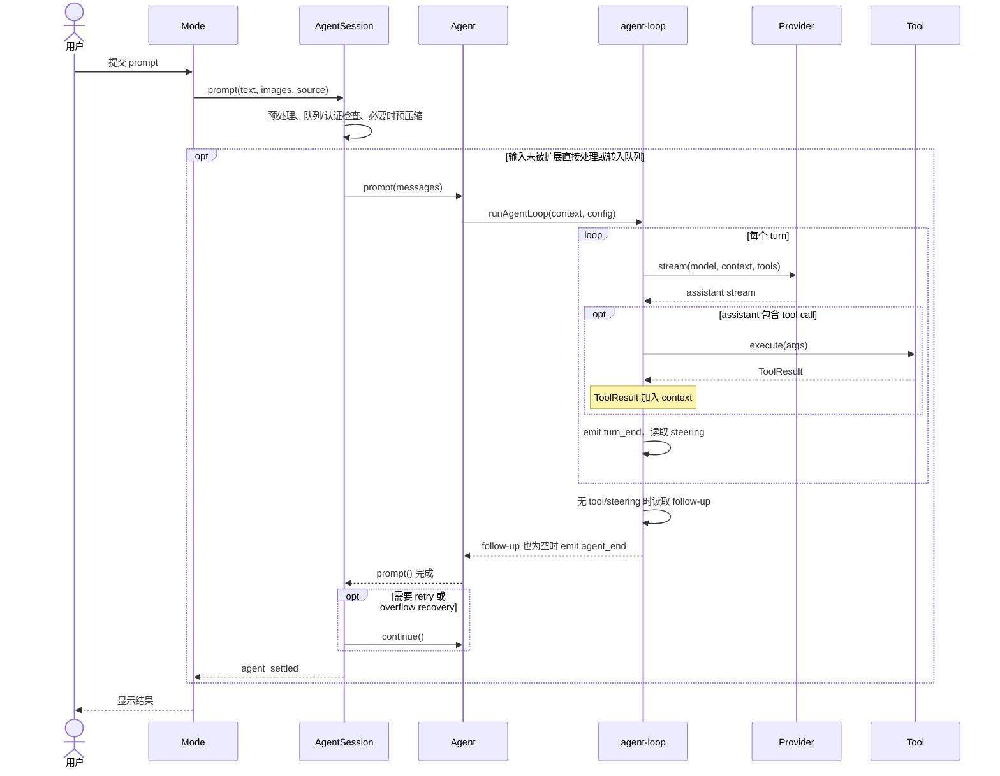
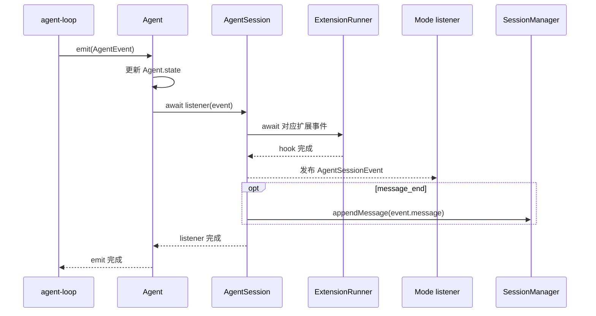

# AgentSession 与 Agent 执行

模型与认证、资源与扩展准备完成后，`createAgentSessionFromServices()` 将它们交给 SDK 的 `createAgentSession()`，后者构造 `Agent` 与 `AgentSession`。本章先沿一次产品请求看这些对象如何配合，再展开底层模型—工具循环。

这里的 agent loop 指模型与工具之间的控制循环：请求模型；如果模型返回工具调用，就执行工具并把结果加入上下文，再请求模型；没有工具调用时结束。一次 run 是从一个新 prompt 开始到本轮处理完全停止；一个 turn 是其中的一次模型响应以及该响应产生的工具结果。

## 1. 一次请求的完整路径

一次请求同时存在“向下的调用”和“向上的事件”。把它们连同扩展 hook、UI 更新和持久化全画在一张时序图中，会掩盖主路径。下面分成两张图：第一张只看请求如何执行，第二张只看事件如何被处理。

### 1.1 请求控制流

`Mode` 是 interactive、print、JSON 或 RPC 适配器。普通 prompt 的输入预处理发生在 `AgentSession.prompt()` 内；直接调用 `steer()`/`followUp()` 时也会复用同一 input hook 和 skill/template 展开链。`ExtensionRunner` 处理 command/input hook，已加载的 `ResourceLoader` 提供 skill 和 prompt template 定义。这些旁路不放进主控制流图。



`turn_end` 每个 turn 都会发生，不只是“assistant 没有 tool call”时才发生。图中的 `execute` 包含参数准备、校验以及扩展 `tool_call`/`tool_result` 截获点；`tool_execution_*` 是另一组用于状态、扩展通知和 UI 的事件。

### 1.2 事件处理与持久化

`agent-loop` 不直接调用 UI 或 `SessionManager`。它发出的每个事件都先经过 `Agent` 更新内部状态，再交给 `AgentSession` 的 awaited listener：



一条消息完成后（触发 `message_end`），`AgentSession` 先让扩展处理这条消息，再通知外部监听函数并保存会话历史。如果扩展将“原始回答”替换为“修改后的回答”，外部监听函数收到的消息和历史中保存的消息都会是“修改后的回答”。

`Agent` 会等待 `AgentSession` 完成这次内部事件处理。不过，通知外部监听函数时，只会直接调用它们，不会等待它们返回的 Promise。例如，监听函数启动了一次异步网络请求，内部事件处理不会等这次请求结束再继续。

### 怎样读这两张图

- `Mode` 是表现或传输适配层；只有 interactive mode 使用 TUI。
- `Agent` 保存运行状态，并拥有 steer/follow-up 核心队列；`agent-loop` 执行模型—工具循环和队列投递；`pi-ai Provider` 处理具体供应商协议。
- 当前 coding-agent 的 `AgentSession` 在这些通用能力外处理输入展开、扩展、设置同步、UI 队列镜像、产品 JSONL 持久化，以及自动压缩/重试的触发与呈现。压缩和队列不是 coding-agent 独有能力；这里只描述正式产品的实际接入路径。
- 工具调用不会创建新的用户请求。工具结果被加入同一个 Agent run 的上下文，随后开始下一个模型 turn。
- `SessionManager` 在 `message_end` 等事件到达时逐步追加 JSONL，不是等整次请求结束后一次性保存。

收到 `agent_end`，表示 Agent 已结束这一轮执行，但收尾工作可能还没做完。`waitForIdle()` 会等 `AgentSession` 内部需要等待的扩展处理、历史保存等工作完成，并清理运行状态后才结束。

这里不会等待所有外部代码。例如，界面通过 `AgentSession` 监听事件，并在监听函数里发起异步网络请求，`waitForIdle()` 不会等这个请求完成。它保证的是 Agent 自身及内部会话处理已经收尾，不保证外部监听函数启动的异步任务也已结束。

### 1.3 具体实现

按一次请求向下调用、再由事件返回的顺序阅读：

要把时序图和源码对应起来，可以先沿这四个调用点走一遍：

1. 在 [agent-session.ts](../packages/coding-agent/src/core/agent-session.ts) 看 `prompt()`，确认输入 hook、模板展开、队列、认证和压缩检查的先后关系。
2. 接着看 [agent.ts](../packages/agent/src/agent.ts) 的 `prompt()` 和 `runWithLifecycle()`，确认 active run 怎样建立。
3. 再看 [agent-loop.ts](../packages/agent/src/agent-loop.ts) 的 `runLoop()` 与 `streamAssistantResponse()`，确认模型—工具循环的调用方向。循环内部的执行顺序见[本章的 Agent loop](#3-agent-loop-的精确控制流)。
4. 最后看 [agent-session.ts](../packages/coding-agent/src/core/agent-session.ts) 的 `_handleAgentEvent()`，确认事件怎样经过扩展、UI/SDK 监听器并写入会话。

### 1.4 输入预处理与队列

`AgentSession.prompt()` 并不直接把字符串传给模型。正常顺序是：

- 扩展命令：立即执行，甚至可在模型流式响应期间运行。
- 扩展 input hook：允许变换或消费输入。
- skill command 和文件 prompt template：在 input hook 之后展开为真实提示。
- streaming 状态：若已有请求运行，要求调用方明确选择 `steer` 或 `followUp`，然后进入队列。
- 非 streaming 状态：检查模型、认证和是否需要预先压缩，再构造包含图片的 user message。
- `before_agent_start` hook：最后允许扩展加入 custom message 或调整本次 system prompt。

steering 在当前 assistant turn 的工具调用结束后注入，follow-up 在 Agent 原本将要停止时注入。核心队列和投递时机由 `Agent`/`agent-loop` 实现，并支持 `one-at-a-time` 和 `all`；`AgentSession` 展开输入、从设置同步模式并维护供 UI 展示的队列镜像。这个区分解决了“纠正正在进行的工作”和“追加下一项工作”语义不同的问题。

`prompt(..., { streamingBehavior })` 与直接调用异步 `steer()`/`followUp()` 都先经过 input hook，再展开 skill/template 后入队；RPC 还会把 input source 标为 `rpc`。因此扩展观察到的 queued input 与普通输入使用同一预处理语义，而不是绕过 hook 的捷径。

#### 1.4.1 具体实现

队列逻辑就在[前面的请求链](#13-具体实现)里，分别关注三个局部：

1. [agent-session.ts](../packages/coding-agent/src/core/agent-session.ts) 的 `_runInputHandlers()`、`_queueUserInput()`、`_queueSteer()` 和 `_queueFollowUp()`：直接队列 API 怎样复用预处理并维护 UI 队列镜像。
2. [agent.ts](../packages/agent/src/agent.ts) 的 `PendingMessageQueue`：核心队列怎样保存和取出消息。
3. [agent-loop.ts](../packages/agent/src/agent-loop.ts) 的两层 `while`：steering 与 follow-up 分别在哪个边界插入。

## 2. `Agent` 的责任

`packages/agent/src/agent.ts` 持有最小运行态：system prompt、模型、thinking level、工具、已完成消息、流式消息、待执行工具和错误。数组赋值会复制顶层数组，避免调用方无意中绕过状态更新边界。

`Agent` 负责：单次活动运行、abort、steering/follow-up 队列、把 loop 事件归约到状态、顺序 await 监听器。它不负责磁盘、UI、扩展发现或具体供应商。

## 3. Agent loop 的精确控制流

`Agent.prompt()` 负责保证同一时刻只有一个 active run，并创建 `AbortController`。真正决定“下一步做什么”的是 `packages/agent/src/agent-loop.ts` 中的 `runLoop()`。

`runLoop()` 有两层循环：

- 内层循环处理模型响应、工具调用和 steering。steering 是用户对当前工作的即时补充，会在当前模型响应及其工具调用结束后、下一次模型请求前插入。
- 外层循环处理 follow-up。follow-up 是等待当前工作自然结束后再开始的追加请求。

一次典型 run 是：

```text
user message
  -> agent_start / turn_start
  -> model response 1
  -> zero or more tool calls
  -> tool results enter context
  -> turn_end
  -> turn_start
  -> model response 2
  -> no tool calls
  -> turn_end / agent_end
```

下一轮不是工具自己发起的。`runLoop()` 看到工具结果后令 `hasMoreToolCalls` 保持为真，于是内层循环再次调用 `streamAssistantResponse()`。

### 3.1 每次模型请求前可以改变什么

从第二个 turn 开始，loop 先调用可选的 `prepareNextTurn()`。coding-agent 用这个位置执行可能的上下文压缩，并允许替换下一轮的 context、model 或 thinking level。准备期间新到达的 steering 也会在模型请求前再次读取。

随后 `streamAssistantResponse()`：

1. 用 `transformContext()` 处理 Agent 自己保存的消息。
2. 用 `convertToLlm()` 去掉只供产品或界面使用的消息字段，得到供应商可接收的消息。
3. 组合 system prompt、消息和工具定义。
4. 在请求时解析可能过期的 credential。
5. 消费供应商返回的流式事件，并转换成 `message_start/update/end`。

这里故意把 `AgentMessage[]` 到供应商 `Message[]` 的转换推迟到请求边界。产品可以在内存和磁盘中保留 custom、bash、compaction 等消息，而 provider 不必理解这些产品类型。

### 3.2 工具并发与确定的上下文顺序

默认 `Agent.toolExecution` 是 parallel。若配置为 sequential，或者批次中任意一个工具声明 sequential，整个批次都串行。并行批次先按调用顺序进行参数准备与前置 hook，再通过 `Promise.all` 启动准备好的工具；当前没有数值型 worker pool 或 semaphore 上限。

参数会经过 `prepareArguments` 和 TypeBox schema 校验，再经过 `beforeToolCall` hook（执行前的扩展检查）；执行结束后再经过 `afterToolCall` hook。

例如模型按 A、B、C 顺序请求三个工具，B 最先结束：

```text
准备与校验：A → B → C
实际完成：  B → C → A        UI 可按此顺序显示进度和结束
写入上下文：A → B → C        等全部完成后按原调用顺序提交结果消息
```

`tool_execution_start` 在准备阶段发出，不代表工具函数已经开始执行。工具返回后，执行器停止接收新的 progress update，并等待已发出的 update promises，再发 execution end，减少工具结束后又冒出旧进度的情况。

文件一致性另由 `withFileMutationQueue()` 处理：正式 coding-agent 按规范化真实路径排队，文件不存在时使用绝对路径，同一路径的修改串行、不同文件仍可并行，`finally` 释放队列。它是进程内 Map，不是跨进程文件锁，也无法约束绕开文件工具的 shell 或扩展直接写入。

因此并行安全需要逐个判断工具的效果：确定的结果顺序不代表执行顺序确定，同文件队列不代表任意副作用受保护，parallel 开关也不代表已经提供并发限流。

实现入口：[agent-loop.ts](../packages/agent/src/agent-loop.ts) 的 `executeToolCallsParallel()`、`executePreparedToolCall()`，以及正式产品的 [file-mutation-queue.ts](../packages/coding-agent/src/core/tools/file-mutation-queue.ts)。Harness 的队列另按 ExecutionEnv 与路径分组，见 [Harness 文件队列](../packages/agent/src/harness/tools/file-mutation-queue.ts)。

### 3.3 退出条件

内层循环在没有更多工具调用且没有 steering 时退出。error/aborted 或停止 hook 可以提前结束整个 run；工具 terminate 则控制是否继续为本批工具请求模型：

- assistant message 的 stop reason 是 `error` 或 `aborted`。
- `shouldStopAfterTurn()` 返回 true。
- 一批实际执行的工具结果全部带 `terminate: true`，因此不再为了这些结果继续请求模型。

一个工具返回 terminate 不会立即取消其他工具；它是批次结果的汇总判断，不是全局急停。

内层结束后，外层读取 follow-up；有消息则重新进入内层，否则发出 `agent_end`。coding-agent 还会在底层 `agent_end` 后处理自动 retry、overflow compaction 和扩展新加入的队列，因此产品层的 `agent_settled` 才表示不会自动继续。

#### 死循环与预算边界

需要分开三种问题：网络请求反复失败、模型不断调用工具、某一个工具永远不返回。它们分别需要重试预算、循环停止策略和执行超时。

`Agent`/`runLoop()` 没有内建最大 turn 数、重复工具参数检测或总费用熔断。比如模型连续十次读取同一文件，每次读取都成功并继续请求模型，网络 retry 预算不会介入，compaction 也只减少上下文长度，不会判定任务没有进展。

SDK 宿主可以通过 `shouldStopAfterTurn` 加入轮数、费用或重复行为策略，这是现有插入点，不是默认已启用的保护。该 hook 在整轮工具完成后才调用，也无法打断一个不返回的工具。总 deadline 需要另行触发取消，工具实现还必须配合 signal；进程内取消不能强制终止任意不合作代码。

内建 bash 的 timeout 可选且没有默认值。指定时会校验为有限正数，并限制在平台 timer 可表达范围内。因此不能将“支持 timeout”写成“所有工具都会在固定时间内结束”。

实现入口：[agent-loop.ts](../packages/agent/src/agent-loop.ts) 的 `runLoop()`、`shouldTerminateToolBatch()`，[agent.ts](../packages/agent/src/agent.ts) 的 `AgentOptions`，[bash.ts](../packages/coding-agent/src/core/tools/bash.ts) 的 schema 与 `resolveTimeoutMs()`。

### 3.4 事件为什么按顺序等待

事件层次对应控制流：`agent_start/end` 包围 run，`turn_start/end` 包围一次模型响应和其工具结果，`message_*` 描述消息，`tool_execution_*` 描述工具。`Agent` 顺序等待每个订阅者处理事件；这让 `AgentSession` 能在运行进入下一阶段前执行扩展并持久化完成消息。

代价是慢事件处理函数会直接增加请求链路延迟。这里选择的是确定的状态顺序，而不是把所有观察者都变成不受控制的后台任务。

### 3.5 具体实现

理解 Agent 内核主要看这两个文件，顺序如下：

1. 读 [`agent-loop.ts`](../packages/agent/src/agent-loop.ts) 的 `runAgentLoop()`、`runLoop()`、`streamAssistantResponse()` 和 `executeToolCalls()`，建立控制流全貌。
2. 读 [`agent.ts`](../packages/agent/src/agent.ts) 的 `prompt()`、`runPromptMessages()`、`runWithLifecycle()` 与 `processEvents()`，确认状态和生命周期怎样包围 loop。

## 4. `AgentSession` 与 `AgentHarness`

`AgentSession` 是正式 coding-agent CLI/SDK 使用的产品运行时。`AgentHarness` 是 agent-core 中已经可执行的 durable runtime；它组合以下通用能力：

- `ExecutionEnv`：文件系统、shell、路径和临时文件端口。
- `Session`：原子提交 entry、typed value/list 和 usage。
- compaction/branch summarization。
- prompt templates、skills 和 system prompt 构建。
- typed telemetry。
- 工具集合、hook、事件与 lane snapshot reducer。

`AgentHarness` 管理会话级资源和 lane 集合；`AgentLane` 是实际操作边界。每条 lane 绑定同名 branch，并持久化模型、thinking、active tools、当前 operation 和 inbox。`prompt()`、`skill()`、`compact()`、`navigateTree()`、`resume()`、`abort()`、steer/follow-up/next-run 队列、`watch()` 与分支/整树 fork 均已有实现和测试。当前唯一公开 stub 是 session 级 `watchSession()`；JSONL 物理压缩、search 和未来格式迁移也仍是明确的后续切片。

正式 CLI/SDK 仍由 `AgentSession` 直接持有 `Agent`，使用自己的 `SessionManager`、extension 系统和产品 compaction。Harness 不在这条默认请求路径，但已进入 coding-agent 的实验性远程路径：

```text
正式 CLI/SDK：AgentSession → Agent / agent-loop
                         → SessionManager JSONL

实验路径：client → server → session worker
                         → AgentHarness / AgentLane
                         → durable Session（JSONL）
                         → ModelRuntime / ExecutionEnv
```

Harness 不把 agent-loop 的内存消息数组当成唯一事实。一次操作先由 `accept()` 原子写入 intent、operation state 和 lane state，再由 lane-owned `Drive` 推进。每次 provider/tool 等外部效果都有前置状态和后置 checkpoint；terminal transaction 先使 lane idle，再单独写 immutable result record。`resume()` 读取持久状态继续，`watch()` 以完整 lane snapshot 开场，再发布带边界标记的增量事件。

这仍不是 exactly-once。provider 可能已计费但响应尚未确认；不可安全重放的工具也可能已产生效果。Harness 的保证是把不确定窗口显式记录，并根据 retry/replay 规则恢复，而不是重复所有副作用。

### 4.1 具体实现

1. 先看 [agent-session.ts](../packages/coding-agent/src/core/agent-session.ts) 的构造函数，确认正式产品怎样直接组合 `Agent`。
2. 读 [`agent-harness.ts`](../packages/agent/src/harness/agent-harness.ts)，确认公开 `AgentHarness`/`AgentLane` 契约。
3. 读 [`runtime/harness.ts`](../packages/agent/src/harness/runtime/harness.ts) 与 [`runtime/lane.ts`](../packages/agent/src/harness/runtime/lane.ts)，确认 lane 获取、operation admission、drive、恢复和 watch。
4. 最后读规范 [`harness.md`](../packages/agent/docs/harness.md)，其中 0.9 节明确列出尚未实现的切片。

## 5. System prompt 与能力必须同步

system prompt 是每次模型请求最前面的行为说明。Pi 不把它视为一段固定常量：`AgentSession` 根据当前启用工具收集工具摘要和使用约束，再由 `buildSystemPrompt()` 组合基础角色、可用工具、通用 guidelines、Pi 文档位置、项目 context files、skills 和 cwd。

这里的关键不是“prompt 写得长”，而是模型描述与真实能力一致：

- 只有当前启用且提供 prompt snippet 的工具才进入 `Available tools`。
- `read`、`edit`、`bash` 等工具可以贡献自己的 guideline；同一 guideline 会去重。
- skills 清单只有在 `read` 或 `bash` 可用时加入，优先提示使用 `read`；清单包含名称、描述和路径，正文按需读取。完整流程见 [Skill 的渐进式加载](./04-resources-and-extensions.md#41-skill-的渐进式加载)。
- 项目 `AGENTS.md` 等 context file 用带来源路径的标签加入，保留指令来自哪里。
- extension 改变 active tools 或 reload 资源后，`AgentSession` 重建基础 system prompt；`before_agent_start` 还能只为本次 run 覆盖它。

工具 schema 与 system prompt 承担不同责任：schema 约束参数是否可解析，prompt snippet 和 guideline 告诉模型何时、怎样使用工具。只有 schema 而没有行为说明，模型仍可能选错工具；只有文字说明而没有 schema，则无法在执行前可靠验证参数。

### 5.1 具体实现

1. 读 [`system-prompt.ts`](../packages/coding-agent/src/core/system-prompt.ts) 的 `buildSystemPrompt()`，确认各输入怎样组成最终文本。
2. 接着看 [agent-session.ts](../packages/coding-agent/src/core/agent-session.ts) 的 `_rebuildSystemPrompt()` 与 `_refreshToolRegistry()`，确认 active tools、tool snippets 和 guidelines 怎样保持同步。
3. 到[扩展 API](./04-resources-and-extensions.md#51-具体实现)中的 `ToolDefinition`，看 schema、prompt metadata 和 renderer 怎样组成一个工具定义。
4. 读 [`skills.ts`](../packages/coding-agent/src/core/skills.ts)，确认 skill 怎样格式化进 prompt；资源的来源与加载过程见[资源系统](./04-resources-and-extensions.md#21-具体实现)。

## 6. 内建工具的设计

工具不是对 Node API 的薄包装，而是带 Agent 语义的安全适配器：

- `read` 支持文本分页、字节/行截断、图片 MIME 检测和可注入图片处理。
- `bash` 捕获 stdout/stderr，按 100ms 节流进度，尾部截断并把完整输出写入临时文件。
- `edit` 对原文件做唯一、非重叠的精确替换，保留 BOM/换行风格，并返回人类 diff 与统一 patch。
- 文件写工具通过 mutation queue 串行化同一路径写入，降低并发工具互相覆盖。

问题示例：如果一个 bash 命令输出 20MB，直接塞进上下文会耗尽 token；只返回前几行又常丢失最终错误。解决方案是保留尾部、提示截断范围并提供完整输出路径。

一个成功的 shell 命令可能输出数百 MB。不能等全部输出收集完再截断，否则模型上下文虽然小，进程内存已经承受了完整数据。

正式 bash 使用 `OutputAccumulator`：流式解码 UTF-8、维护用于展示的滚动尾部、在超出阈值后把完整原始输出保存到临时文件。工具返回截断内容、原因和完整输出路径；进度更新另做节流，结束时刷新剩余更新并关闭输出流。

这限制的是内存中展示尾部和进入模型的内容，不是磁盘总配额。实现没有给临时日志设置总大小上限；文件写入也没有通过等待 `drain` 对 shell 建立完整背压。长时间高速输出仍应结合任务级取消与宿主资源限制。

### 6.1 具体实现

1. 读 [`tools/index.ts`](../packages/coding-agent/src/core/tools/index.ts)，确认工具工厂怎样注入 cwd 和执行能力。
2. 按关心的问题选择 [`read.ts`](../packages/coding-agent/src/core/tools/read.ts)、[`bash.ts`](../packages/coding-agent/src/core/tools/bash.ts) 或 [`edit.ts`](../packages/coding-agent/src/core/tools/edit.ts)，理解参数验证、截断和结果格式。
3. 再对照 3.5 中的 `executeToolCalls()`，确认具体工具怎样进入共同调用生命周期。
4. 读 [`file-mutation-queue.ts`](../packages/coding-agent/src/core/tools/file-mutation-queue.ts)，确认同一路径写入为何必须串行化。
5. 读 [`output-accumulator.ts`](../packages/coding-agent/src/core/tools/output-accumulator.ts)，确认滚动尾部、完整输出文件和背压限制。

## 7. 中止与错误边界

AbortSignal 从 run 传到 provider 和工具。模型中止会生成 `aborted` assistant message，而不是让历史出现没有终态的流式消息。工具失败转换为 `toolResult` error，使模型有机会解释或恢复；基础设施级错误才终止 run。

重试分布在不同层，不能统一称为“Agent retry”：`pi-ai` 提供 provider 请求的通用 retry helper，具体 provider 也可能处理传输级重试；`AgentHarness` 将 assistant/summary attempt 与 durable retry wait 写入 operation state，重启后仍遵守同一 budget；正式 coding-agent 的 `AgentSession` 则根据完整 assistant error、产品设置和 UI 生命周期安排下一次 turn。共享的 `RetryPolicy.maxAgentDelayMs` 对指数退避的单次等待设上限，省略时默认为 60 秒；默认策略也避免在额度耗尽等非瞬时错误上长期隐藏真实状态。

## 8. Reducer 与不变量

状态变化集中通过事件 reducer 表达，重要不变量包括：

- 同一时刻只有一个 active run。
- `pendingToolCalls` 由 start/end 成对维护。
- completed message 只在 `message_end` 追加。
- streaming message 在 `message_start/update` 更新，在 end 清除。
- idle 必须晚于 `Agent` 内部所有 awaited listener；`AgentSession` 对宿主发布的公开 listener 是同步通知。

这种设计使 UI 可以只订阅事件而无需猜测内部阶段，也使 session 持久化能与 Agent 状态保持相同顺序。
