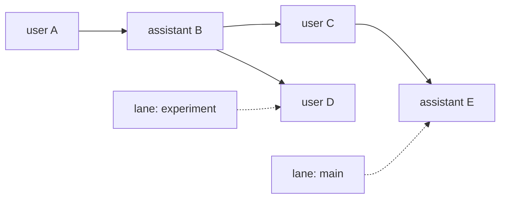

# 会话、上下文压缩与持久化

正式产品与实验性 Harness 各有一套会话子系统。它们都保存历史并生成模型上下文，但类型、文件格式、压缩实现和调用入口独立。

| 子系统 | 使用者 | 核心类型 | 存储 |
|---|---|---|---|
| coding-agent 产品会话 | 正式 CLI/SDK 的 `AgentSession` | `SessionManager` | coding-agent JSONL |
| agent-core durable session | `AgentHarness`、实验性 session worker 和自定义宿主 | `Session`、`SessionRepo`、`Storage` | JSONL、内存、SQLite |

## 1. 正式产品会话

`packages/coding-agent/src/core/session-manager.ts` 负责正式产品的会话历史、resume、fork、clone、导航和 JSONL 文件。`AgentSession` 订阅 `Agent` 事件，在 user、assistant 和 tool result 完成时逐步追加记录。新建持久会话在首次 assistant 消息完成前只保留内存记录；首次写入会把 header 与已有 entry 一起保存，此后逐条追加。内存会话不写文件。

正式产品的压缩位于 `packages/coding-agent/src/core/compaction/`。它根据 coding-agent 的 session entry 和产品设置生成摘要，由 `AgentSession` 决定手动压缩、阈值压缩和 overflow recovery 的触发与 UI 事件。压缩是通用问题，但这里是正式产品当前使用的具体实现。

### 1.1 为什么采用树状历史

编码任务经常需要回到某次分析之后，换一种方案继续，同时保留原方案的探索记录。例如先尝试方案 A，验证失败后回到分析节点 B，再尝试方案 B。下面每个节点代表一条消息，省略工具调用等中间记录：

```text
U：描述问题 → B：分析问题
                 ├─ A1：尝试方案 A → A2：验证失败
                 └─ B1：尝试方案 B → B2：验证成功
```

单条线性历史若只靠截断来回退，会丢失 A1、A2；若复制为独立会话，会重复保存共同前缀 U、B；若把所有消息继续串在一起，方案 A 的完整过程也会进入后续上下文。树结构用父节点引用共享前缀，让每条探索路径可以独立继续，也能保留和重新访问旧路径。

在 `SessionManager` 中，这个过程只需要移动当前指针并追加记录：

1. 方案 A 结束时，`leafId` 指向 A2。
2. `branch(B)` 把 `leafId` 移到 B，已有记录保持不变。
3. 追加 B1 时，将它的 `parentId` 设为 B，再把 `leafId` 移到 B1；B 因而同时拥有 A1 和 B1 两个子节点。
4. 到 B2 时，构造上下文沿父链取出 U、B、B1、B2。没有分支摘要或压缩时，模型收到这条路径上的消息，A1、A2 仍保存在历史中。

JSONL 文件按追加顺序保存 U、B、A1、A2、B1、B2；`parentId` 决定对话路径，所以不能直接把文件中所有消息按行顺序发送给模型。这里的 leaf 表示当前活动位置，回退时可以指向已有子节点的历史节点。

如果需要把方案 A 的失败原因带给方案 B，可以在导航时选择生成 branch summary。`branchWithSummary()` 在目标位置追加摘要节点，后续消息接在摘要之后。摘要传递旧路径的必要信息，旧路径本身仍然保留；compaction 则负责缩短同一活动路径的上下文，见第 2、3 节。

这个设计把完整历史的保留与本次模型输入的选择分开。代价是需要维护父链、活动指针和树导航，并在构造上下文时处理摘要边界。只支持顺序对话时，线性列表已经足够；支持保留历史的回退与多路线探索时，这些机制才有明确用途。会话树记录的是对话历史，移动指针本身不会撤销工具已经写入的工作区文件。

实现入口见 [`session-manager.ts`](../packages/coding-agent/src/core/session-manager.ts) 的 `branch()`、`appendMessage()`、`branchWithSummary()` 和 `buildSessionContext()`；文件字段与 API 参考见 [Session File Format](../packages/coding-agent/docs/session-format.md#tree-structure)。

## 2. 正式产品怎样生成模型上下文

context（上下文）是下一次请求实际交给模型的 system prompt、消息和工具定义。磁盘 session 由 entry 组成；entry 是每次追加的一条消息、模型变更、压缩或其他会话记录，并通过 `parentId` 形成树。leaf 指向当前活动位置，决定下一条 entry 接在哪里。`SessionManager.buildSessionContext()` 只从当前 leaf 所在分支生成本次需要的消息。

没有压缩时，它沿每条 entry 的 `parentId` 从当前 leaf 回到根，再恢复为正序消息。有压缩时，它使用：

```text
最新 compaction entry 中的 summary
  + firstKeptEntryId 开始的近期原始 entry
  + compaction entry 之后新产生的 entry
```

因此 session history、活动分支和模型 context 是三份相关但不同的视图。压缩改变 context 的生成方式，不删除历史。

## 3. 正式产品的 compaction 算法

compaction（上下文压缩）把较早消息总结成摘要，并保留近期原始消息。默认设置预留 16,384 token 给提示和下一次模型输出，并尝试保留最近 20,000 token 的原始消息；用户可以设置普通值，也可以在 `compaction.modelOverrides` 中按精确、区分大小写的 `provider/modelId` 分别覆盖这两个预算。每个字段按“匹配模型的覆盖值 → 普通值 → 内建默认值”独立解析，`enabled` 仍是全局开关。

### 3.1 何时触发

有三条入口：

- manual：用户明确调用压缩。
- threshold：估计的 context token 大于 `contextWindow - reserveTokens`。
- overflow：供应商报告上下文溢出，或响应因可恢复的长度限制被截断。

token 估算优先使用最近一次有效 assistant usage，因为它是供应商对真实请求的计数；最后一次 usage 后新增的消息用字符数近似补上。如果没有有效 usage，所有消息都用估算。压缩后会拒绝使用压缩前的旧 usage 再次触发压缩，避免刚压缩完立刻重复执行。

### 3.2 怎样选择切分点

`prepareCompaction()` 先找到最近一次 compaction 边界，然后 `findCutPoint()` 从最新 entry 向前累计估算 token，直到达到 `keepRecentTokens`。

切分不能落在 `toolResult` 上，因为工具结果必须跟在产生它的 assistant tool call 后面。允许从 assistant entry 开始保留；如果这会切开一个 turn，Pi 额外找到该 turn 的 user 起点，并把被切掉的 turn 前半部分单独总结。这样既能保留大型工具调用后的近期结果，也不会让保留部分失去原始任务背景。

准备结果明确分成：

- `messagesToSummarize`：较早历史，将进入主摘要。
- `turnPrefixMessages`：被切开 turn 的前半段，将进入 turn-prefix 摘要。
- `firstKeptEntryId`：近期原始消息从哪里开始保留。
- `previousSummary`：上一次压缩摘要，用于增量更新而不是遗忘旧摘要。
- `fileOps`：从工具调用提取的已读和已修改文件，附在摘要中保留工作状态。

### 3.3 怎样生成和落盘

默认实现用当前模型发起独立总结请求。总结请求禁用 prompt cache，避免为这次独立总结写入供应商缓存；瞬时网络错误仍使用独立 retry 策略。若模型以 `length` 结束、返回 error 或试图调用工具，摘要不会保存。

成功后，`AgentSession` 追加一个 compaction entry，其中保存 summary、`firstKeptEntryId`、压缩前 token 数、usage 和文件操作信息。随后它重新调用 `buildSessionContext()` 并替换 `Agent.state.messages`。原 entry 仍在 JSONL 中，所以导出、树浏览和再次分支仍能看到完整历史。

### 3.4 overflow 怎样恢复

若本次 assistant 因 overflow 或可恢复的长度限制失败，错误消息已经随 `message_end` 写入 session history。恢复时 Pi：

1. 从当前 Agent context 临时移除失败的 assistant message。
2. 执行 compaction 并重建 context。
3. 再次移除可能被重建带回的失败消息。
4. 调用 `agent.continue()` 重试被中断的 turn。

自动恢复最多尝试一次，防止“压缩—重试—再次溢出”无限循环。若 response 已成功结束但实际 context 已超限，只压缩供下一次使用，不重试已经完成的回答。

手动压缩、阈值检查、overflow recovery 和扩展看到的 `preparation.settings` 使用同一组按当前模型解析后的预算。模型切换会影响下一次检查；已经开始的压缩继续使用启动时捕获的模型和设置。

### 3.5 扩展可以改变什么

`session_before_compact` hook 可以取消本次压缩，或直接提供自定义 compaction result；默认算法只在扩展没有接管时运行。成功后发 `session_compact`，失败后发 `session_compact_failed`。压缩的触发与历史更新由产品管理，扩展可以替换摘要生成过程。

### 3.6 具体实现

按生成上下文、判断是否压缩、生成摘要、重建上下文的顺序阅读：

1. 在 [`session-manager.ts`](../packages/coding-agent/src/core/session-manager.ts) 定位 `buildContextEntries()`：确认活动分支怎样投影成模型消息。
2. 在 [`agent-session.ts`](../packages/coding-agent/src/core/agent-session.ts) 定位 `compact()` 和 `_checkCompaction()`：分别确认手动入口与自动阈值、溢出恢复检查。
3. [`compaction.ts`](../packages/coding-agent/src/core/compaction/compaction.ts) 的 `estimateContextTokens()`、`findCutPoint()` 和 `prepareCompaction()`：确认 token 估算与切分不变量。
4. 继续读同一文件的 `compact()` 与 `completeSummarization()`：确认摘要请求、失败条件和结果结构。
5. 回到同一个 [agent-session.ts](../packages/coding-agent/src/core/agent-session.ts) 定位 `_runAutoCompaction()`：确认 compaction entry 落盘、context 替换和 overflow 重试。

## 4. Durable session 模型

`packages/agent/src/harness/session` 把一个原子 commit 表示为四类 write：

- entry：有 `id`、`parentId`、`seq` 和时间戳的不可变历史节点。
- value set/delete：按 namespace/key 保存当前值，例如分支指针、lane 配置与状态、操作状态。
- list append/delete：保存有序的追加事实，当前用于 assistant frame 和工具输出等运行记录。
- usage：独立累计的 usage row，可关联 entry，也可表示 adjustment。

这些写入共享同一个全局 sequence 空间并在一次 `Storage.commit()` 中原子发布。entry 适合保留事实树；value 适合可替换的程序计数器；list 适合流式追加；usage 适合独立统计。恢复时可直接读取当前 operation state；对话树则只保留需要长期保存的历史节点。

接口按范围拆分：`SessionRepo` 面对“有哪些会话”，负责创建、列出、打开、删除和 fork；`Storage` 面对一个已打开会话的原子写入与查询；`StorageBackedSession` 再提供 branch、名称/标签和 mutation line。`Session.mutate()` 给调用方一个 callback-scoped mutator，整段期间独占会话 mutation line，且最多提交一次。这样上层可以先读取当前 state、验证不变量，再把 entry、value、list 与 usage 一起提交。

## 5. 树、lane 与上下文



branch 是 durable session 中的命名历史指针；lane 是附着在同名 branch 上的 Agent 执行配置与状态。仅保存历史的 branch 可以没有 lane config；`AgentHarness.lane()` 只会取得或显式创建一条配置完整的 Agent lane。分支不需要复制整个消息数组，只需更新 `pi.branch.tip` value，再沿 parent 链计算活动路径。Harness context projection 把路径中的 message/compaction/branch-summary/custom entry 投影成模型消息；模型、thinking level 和 active tools 来自 lane configuration，不再通过历史中的 change entry 派生。

## 6. Agent-core compaction 模块

Agent-core 的压缩模块生成摘要、压缩前 token 数和保留的近期消息，结果写入 `compaction` entry。构建模型上下文时，使用最近一次压缩的摘要、保留消息和后续节点，原消息仍保存在历史树中。`AgentLane.compact()` 已接入操作接纳、可恢复的摘要重试、hook、usage 与最终结果记录；普通 run 也会在检查点根据阈值触发压缩。

分支跳转也可以生成 branch summary，把离开路径的必要信息带到目标分支。压缩和分支摘要都是上下文投影，不是删除历史。其实现位于 `packages/agent/src/harness/compaction/`，与 coding-agent 的产品压缩代码独立。

## 7. Durable session 后端

### JSONL

agent-core 的 JSONL 格式当前为 v4：第一行是 header，后续每行一个完整 transaction。单 write 直接编码为对象，多 write 原子提交编码为数组，因此文件行边界同时也是事务边界。写入先追加磁盘再更新内存状态；Session mutation line 保证一个会话只有一条提交序列。

恢复逻辑只重放完整换行终止的 transaction，并可移除被截断或缺少换行的尾部。JSONL fork 先捕获源的 sequence 边界，第一遍只索引 parent、当前 value/list 和 lane 元数据，第二遍把选中的 entry 与当前状态流式写入临时文件，再原子发布目标文件；它不会为大型会话先构造完整 payload snapshot，也不会切开源 transaction。

### 内存

`MemorySessionRepo` 与内存 `Storage` 实现同一接口，用于测试或不需要落盘的宿主。

### SQLite

`pi-session-backend-sqlite-node` 提供 `SqliteSessionRepo` 与 `SqliteStorage`。它把 sessions、entries、values、list elements、usage 和统计映射到表，并以数据库事务实现同一原子 commit 语义。会话所有权由 repo/open 边界协调，而不再通过旧的 writer-lease/branch-cache 模块描述。

三种后端共享两层公共行为测试：`createStorageConformance()` 检查原子 writes、sequence、value/list、usage、branch scan 和 close；`createSessionRepoConformance()` 检查生命周期、所有权、消息、branch/tree fork 和目标预留。测试不比较内部文件或数据表，只比较调用方可观察语义。

### 7.1 具体实现

1. 读 [`types.ts`](../packages/agent/src/harness/session/types.ts) 的 `Storage`、`Session` 与 `SessionRepo`，先确认原子写入、单会话和会话集合的边界。
2. 读 [`values.ts`](../packages/agent/src/harness/session/values.ts) 与 [`session.ts`](../packages/agent/src/harness/session/session.ts)，确认 typed value/list、branch 和 mutation line 怎样组合底层 storage。
3. 选择一个后端研究落盘策略：[`jsonl/repo.ts`](../packages/agent/src/harness/session/jsonl/repo.ts)、[`jsonl/storage.ts`](../packages/agent/src/harness/session/jsonl/storage.ts)、[`jsonl/io.ts`](../packages/agent/src/harness/session/jsonl/io.ts) 与 [`jsonl/fork.ts`](../packages/agent/src/harness/session/jsonl/fork.ts)，或 [`sqlite-node/src`](../packages/session-backends/sqlite-node/src)。
4. 需要理解后端必须保持的共同语义时，再读 [`conformance/storage.ts`](../packages/agent/src/harness/session/testing/conformance/storage.ts) 与 [`conformance/session-repo.ts`](../packages/agent/src/harness/session/testing/conformance/session-repo.ts)。

## 8. 两个子系统不能混用名称

正式 CLI 的 `SessionManager` JSONL 不实现 durable `Storage`，也不是 `SessionRepo` 的一个后端。反过来，SQLite backend 也不会自动替换正式 CLI 的 JSONL。

两边都有树、分支、上下文投影和摘要压缩，是因为它们解决相同类别的问题；这不代表它们已经接入同一运行时。当前正式 CLI/SDK 使用 `AgentSession` + `SessionManager`；实验性 client/server/session-worker 路径使用 `AgentHarness` + durable `Session`。两套 JSONL 格式和运行时仍然独立。

## 9. 会话替换生命周期

`AgentSession` 代表一个稳定会话；`AgentSessionRuntime` 代表“当前活动会话及其 cwd 绑定服务”。`/new`、resume、fork、clone 和 import 都属于后者。切换顺序是：

1. 发出可取消的 `session_before_switch`/`session_before_fork`。
2. abort 当前响应并等待工具结果等落盘。
3. 发 `session_shutdown`。
4. 同步解绑宿主 UI，dispose 旧 session。
5. 按目标 cwd 创建 settings/model/resource 服务。
6. 创建新 session 并替换 runtime 中的对象图。
7. 宿主重新订阅、调用 `bindExtensions()`，并在这个绑定阶段发 `session_start`。

这个顺序用于避免两类具体错误：旧扩展组件在新 session 中继续接收事件，以及跨 cwd 恢复时错误复用原目录的设置或资源。

### 9.1 具体实现

1. 读 [`agent-session-runtime.ts`](../packages/coding-agent/src/core/agent-session-runtime.ts) 的 switch、fork 和 new 操作，确认替换过程的总顺序。
2. 接着看 [agent-session.ts](../packages/coding-agent/src/core/agent-session.ts) 的 `createReplacedSessionContext()`，确认替换后提供给扩展的操作接口；新 cwd 下的依赖创建见 [agent-session-services.ts](../packages/coding-agent/src/core/agent-session-services.ts)。
3. 读 [`interactive-mode.ts`](../packages/coding-agent/src/modes/interactive/interactive-mode.ts) 的 rebind 逻辑，确认 UI 怎样解绑旧 session、订阅新 session。
