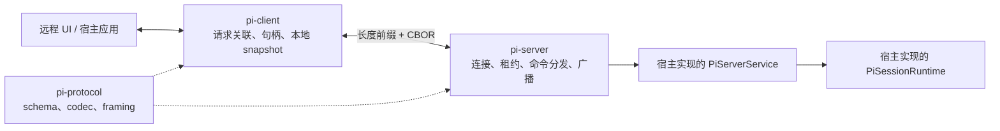

# 跨进程协议、测试与工程治理

这里的 protocol 是跨进程消息格式；client 是发命令并维护本地会话状态的调用端；server 是接收连接、路由会话和转发事件的服务端。它们不包含真正执行模型和工具的 Agent。

## 1. 先明确当前状态

protocol/client/server 是实验性的跨进程会话基础设施，不是远程桌面，也不是 coding-agent 的另一种实现。

当前 HEAD 中：

- `pi-protocol`、`pi-client` 和 `pi-server` 是独立发布包。
- `pi-server` README 明确说明它不提供 standalone CLI 或 coding-agent service。
- 正式 `pi` CLI 不进入 `src/cli/experimental/cli.ts`。
- coding-agent 内部的 `createCodingAgentHarness()` 有源码和测试，但返回的 Harness 执行外壳本身尚未完成，也没有被组装成 `PiServerService`。
- 仓库没有将 `AgentSession` 或 `AgentHarness` 接到 `pi-server` 的完整正式服务实现。

所以它们不能被描述为“远程版 coding-agent”。准确说法是：它们定义了远程控制会话所需的协议、客户端状态和服务端调度；宿主仍需提供真正运行会话的实现。

## 2. 三个包分别做什么

snapshot 是用于初次同步或重连恢复的完整状态快照，progress 是运行过程中低延迟发送的增量变化。



- `pi-protocol` 定义命令、事件、snapshot schema、CBOR 编解码和长度分帧。
- `pi-client` 建立连接，为请求分配 ID，维护 pending response、session handle 和本地 snapshot。
- `pi-server` 接受已认证的连接，处理 hello 和命令，管理会话 lease，并广播 snapshot/progress。lease 是某个连接暂时取得的会话修改权。
- `PiServerService`/`PiSessionRuntime` 是宿主需要实现的边界，真正的 Agent 行为在边界后面。

`PiSessionRuntime` 只暴露受限会话操作：

```text
snapshot / prompt / steer / abort
setModel / setThinking / subscribe / dispose
```

协议没有键鼠、屏幕、任意 shell 或文件 API。某个实际 Agent 能否执行 `bash`、`read` 等工具，取决于宿主提供的 runtime。

## 3. 与 coding-agent SDK 的区别

`pi-coding-agent` SDK 是进程内完整编码 Agent；client/server 是跨进程通信和会话管理基础设施：

```text
进程内：应用 → pi-coding-agent SDK → AgentSession → Agent / agent-loop

跨进程：应用 → pi-client → pi-protocol → pi-server
                                          → 宿主的 PiSessionRuntime
                                          → 宿主选择的实际 Agent
```

因此 client/server 自己不能被称为“可独立存在的 Agent”。它们可以独立于 coding-agent 发布和复用，但必须接到某个 runtime 才会产生 Agent 行为。

一个直接类比：`pi-coding-agent` SDK 像进程内数据库驱动；protocol/client/server 像数据库的网络协议、客户端和连接服务器。网络层解决跨进程访问，不会自动提供数据库引擎。

client/server 值得存在，是因为跨进程场景需要额外解决：

- UI 退出或断线后，运行时可以继续存在。
- UI 重连后，用权威 snapshot 恢复状态。
- UI 和 Agent 可以位于宿主机、容器或服务器等不同位置。
- 多个连接可以观察会话，由 server 统一管理修改租约。
- 一个服务可以列出和路由多个长期会话。

如果调用方与 Agent 在同一进程，生命周期也一致，直接使用 coding-agent SDK 即可，无需增加这层复杂度。

## 4. 协议格式与状态同步

消息先经 strict schema 验证，再编码为 CBOR，最后添加长度前缀。decoder 可以处理任意网络 chunk 边界，并限制最大 frame；第一帧必须是带整数版本的 hello。

命令包括 list/create/attach/detach/prompt/steer/abort/set-model/set-thinking。服务端事件包括 server snapshot、session snapshot、session progress 和 removed。

snapshot 是权威状态，progress 是低延迟增量。客户端丢失增量或重新连接后，可以用 revision 更新的 snapshot 重新收敛，而不必假设自己收到了每个中间事件。

## 5. Client 与 Server 的运行语义

`PiClient` 用 pending map 关联 request ID 与 response；连接断开时统一 reject 未完成请求。`PiSessionHandle` 封装 session ID 和 lease，调用方无需手工拼装每条命令。

`PiServer` 通过 listener 接收连接；listener 必须先完成传输相关的认证与授权。server attach/acquire 会建立 lease，避免冲突操作同时修改同一 session；连接关闭时释放相应租约。

server 通过 `PiSessionRuntime.subscribe()` 接收 snapshot、progress 和 error 通知，再转成协议事件。它不暴露内部 Agent 对象。

### 5.1 具体实现

1. 读 [`schemas.ts`](../packages/protocol/src/schemas.ts)，确认 wire protocol 允许哪些命令与事件。
2. 读 [`codec.ts`](../packages/protocol/src/codec.ts) 和 [`framing.ts`](../packages/protocol/src/framing.ts)，确认 schema 对象怎样跨越字节流边界。
3. 读 [`client.ts`](../packages/client/src/client.ts) 与 [`session-handle.ts`](../packages/client/src/session-handle.ts)，确认请求关联、snapshot 和 lease 怎样呈现给调用方。
4. 读 [`server.ts`](../packages/server/src/server.ts) 与 [`sessions.ts`](../packages/server/src/sessions.ts)，确认 attach、租约释放和事件广播。

## 6. 测试架构

| 层 | 方法 | 目的 |
|---|---|---|
| 纯逻辑 | Vitest / node:test | reducer、codec、布局和截断等确定性行为 |
| 契约一致性 | 多个实现运行同一套公共测试 | 保证对调用方可观察的语义一致 |
| Provider | faux provider + fixtures | 无真实密钥验证 streaming、tools、retry 和 compaction |
| 终端 | virtual terminal / tmux | Unicode、cursor、overlay、fullscreen 和交互回归 |
| 产品回归 | `coding-agent/test/suite/regressions` | 用最小场景固定 issue 行为 |
| 行为评测 | `pi-evals` + vitest-evals | 用真实模型比较 prompt、tool 和 skill 效果 |
| 发布 smoke | 仓库外隔离安装 | 防止 workspace 解析掩盖打包问题 |

根 `test.sh` 清理相关环境变量并使用临时用户目录，避免本机凭据和配置使测试误调用真实 API。

## 7. 静态质量门与发布

`npm run check` 执行格式与静态检查、精确依赖检查、TS import 规则、shrinkwrap/lock 校验、类型检查和 browser smoke。它不等于测试通过。

项目将供应链作为安全边界：直接外部依赖使用精确版本；CI 以 `--ignore-scripts` 安装；coding-agent shrinkwrap 固定发布侧传递依赖；带 lifecycle script 的新依赖必须显式审核。

release script 同步所有包版本、生成产物、运行检查、创建提交和 tag；tag CI 构建并发布 npm，再验证 tarball 可用后更新公开版本标记。发布 helper 是幂等的，失败时应修复并重跑 job，而不是为同一版本重新执行 release。

### 7.1 具体实现

本节讨论的是工程质量门，不属于理解 Agent 运行时的主阅读链路：

1. [`package.json`](../package.json)：确认 `check`、`test`、`eval` 与 release 是不同入口。
2. [`test.sh`](../test.sh)：确认普通测试怎样隔离本机认证和配置。
3. session 后端怎样共享行为契约，见 [durable session 后端](./04-session-and-persistence.md#71-具体实现)。
4. [`faux.ts`](../packages/ai/src/providers/faux.ts)：确认无需真实模型的 provider 场景怎样构造。
5. [`build-binaries.yml`](../.github/workflows/build-binaries.yml)：确认构建、发布和发布后验证的边界。
