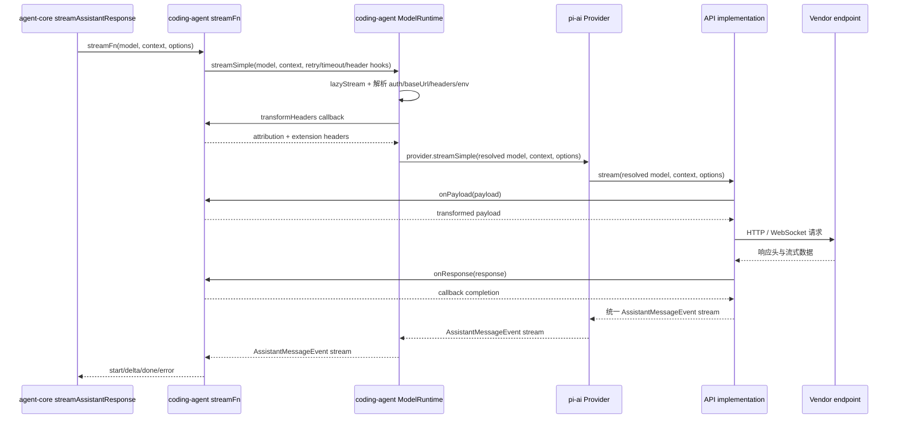

# 模型 Provider 请求调用链

主负责 package：`pi-coding-agent` 的 `ModelRuntime` 与 `pi-ai` 的 Provider/API implementation。

## 1. 先区分创建期和请求期

创建期组合“有哪些 provider 和 model”：内建 provider、`models.json`、远程 catalog cache、extension provider 与凭据状态进入 `ModelRuntime` snapshot。

请求期处理“这一次如何调用”：重新解析 credential、base URL、headers 和 env，然后才进入选定 provider 的 stream 实现。短期 OAuth token、命令型 credential 和 extension header hook 因而不会在启动时被冻结。

## 2. 请求主链

`streamFn` 提供给 `ModelRuntime` 的回调内部才会调用 `ExtensionRunner`：`transformHeaders` 对应 `before_provider_headers`，`onPayload` 对应 `before_provider_request`，`onResponse` 对应 `after_provider_response`。图中保留回调边界，不把扩展 runner 误画成 `ModelRuntime` 或 API implementation 的直接依赖。

## 3. coding-agent 注入的请求策略

`createAgentSession()` 创建 `Agent` 时提供 stream function。每次请求动态读取 settings 中的 provider retry、HTTP idle timeout、WebSocket connect timeout 和最大 retry delay，并注入：

- provider attribution headers。
- extension 的 `before_provider_headers`。
- extension 的 `before_provider_request` payload hook。
- response 到达后的 `after_provider_response` hook。
- 当前 session ID、abort signal 和 transport。

这些是产品策略，因此位于 coding-agent；agent-core 只把 config 交给 stream function。

## 4. `ModelRuntime.prepareRequest()`

请求真正开始时：

1. 按 `model.provider` 找到已经组合好的 Provider。
2. 使用显式 apiKey/env override、runtime credential、持久 credential 或 provider auth resolver 解析认证。
3. 合并认证 header、model header 和本次请求 header。
4. 执行 coding-agent 提供的 `transformHeaders`。
5. 将认证给出的 base URL 写入本次 request model。
6. 调用 `provider.streamSimple()`。

`lazyStream` 让上述异步准备发生在消费者真正迭代 stream 时，同时仍向上提供统一的 event stream/result 接口。

## 5. Provider 与 API implementation 的边界

Provider 决定模型集合、认证、过滤、目录刷新和 stream 入口。API implementation 负责把统一 `Context` 转成 Anthropic/OpenAI/Google 等 wire protocol，并把厂商 SSE、WebSocket 或 JSON 事件还原为统一事件。

某些跨 API 规则属于 provider wrapper，而不是单个 adapter：OpenCode/OpenCode Go 在分派前把 `sessionId` 加为 `x-opencode-session`；OpenRouter 通过 compat 让 OpenAI Completions 和 Anthropic Messages 都发送 `x-session-id`。显式传入的同名 header 优先，避免 wrapper 覆盖调用方决策。

上层 loop 只接收 `start`、文本/thinking/tool-call delta、`done` 或 `error`，不理解厂商 payload。最终 assistant message 必须包含一致的 usage、stop reason、content block 和错误状态。

## 6. 失败和取消

- provider 不存在：`ModelsError("provider")`。
- 没有可解析 credential：`ModelsError("auth")`。
- header/payload hook 抛错：本次请求失败，由 agent lifecycle 转成 error message。
- abort signal 向 credential 解析、网络 stream 和工具循环传递。
- provider 返回统一 error event 后，coding-agent 决定是否 retry、compaction recovery 或结束。

## 7. 必须保持的不变量

- 模型“存在”和“当前认证可用”必须分开表示。
- credential 和动态 header 必须在请求边界解析，不能只在启动时缓存最终值。
- provider-specific wire event 不能泄漏到 agent-core。
- extension header hook 必须在认证/header 合并后、网络请求前执行。
- 每个 stream 必须只有一个最终 done/error 结果。

## 8. 源码入口

1. [`sdk.ts`](../../packages/coding-agent/src/core/sdk.ts)：为 `Agent` 注入产品级 stream function 和 provider hooks。
2. [`model-runtime.ts`](../../packages/coding-agent/src/core/model-runtime.ts)：`prepareRequest()` 与 `streamSimple()`。
3. [`models.ts`](../../packages/ai/src/models.ts)：provider/auth 的通用解析和 stream 分派。
4. [`types.ts`](../../packages/ai/src/types.ts)：Model、Provider 和统一事件契约。
5. [`api/anthropic-messages.ts`](../../packages/ai/src/api/anthropic-messages.ts)：一个具体 API implementation 示例。
6. [`providers/opencode-headers.ts`](../../packages/ai/src/providers/opencode-headers.ts)：一个跨 API provider wrapper 示例。
7. [`agent-loop.ts`](../../packages/agent/src/agent-loop.ts)：统一 stream 如何还原成 Agent events。
