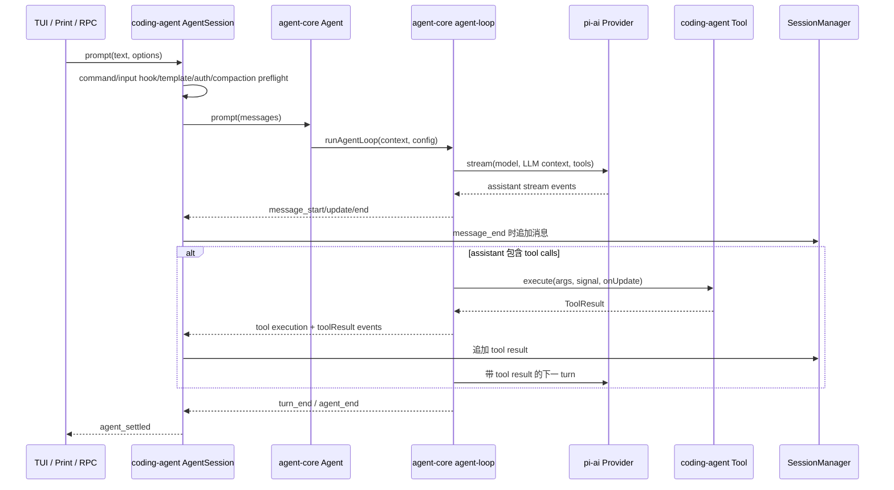

# Prompt、Agent Loop 与工具执行

主负责 package：`pi-coding-agent` 和 `pi-agent-core`。跨包边界：模型请求进入 `pi-ai`，工具实现回到 `pi-coding-agent`。

## 1. 端到端主链

## 2. `AgentSession.prompt()`：产品预处理

进入 agent-core 前依次处理：

1. `/command` extension command，可在流式响应期间立即执行。
2. 阻止 compaction 期间直接提交普通 prompt。
3. `input` extension hook，可消费或转换文本与图片。
4. skill command 和 prompt template 展开。
5. 已在 streaming 时，根据调用方显式选择进入 steer 或 follow-up 队列。
6. 非 streaming 时刷新待提交的 bash/custom message，验证模型和认证。
7. 必要时在新 prompt 前执行 compaction。
8. 构造 user message，合入 next-turn custom message。
9. 执行 `before_agent_start`，允许 extension 追加消息或调整本次 system prompt。
10. 调用 `Agent.prompt()`。

这层负责产品语义；agent-core 不认识 slash command、skill、项目设置或 session JSONL。

## 3. `Agent`：单 active run 与配置快照

`Agent.prompt()` 拒绝并行启动第二个 active run，然后创建 context/config 快照并进入 `runWithLifecycle()`。该生命周期创建 `AbortController`，设置 streaming 状态，捕获未转成模型事件的异常，并在 finally 中结束 active run。

传给 loop 的配置包含 model、thinking、tools、context transform、credential resolver、steer/follow-up 取队列函数，以及 tool 前后 hook。loop 因而只依赖抽象回调，不依赖 coding-agent 的具体存储或 UI。

## 4. Agent loop 的两层循环

内层循环处理“模型响应 → 工具 → 下一模型 turn”，以及应尽快插入的 steering message。外层循环在 Agent 原本准备结束时检查 follow-up queue。

每个模型 turn：

1. 可选执行 `prepareNextTurn`，coding-agent 可在这里压缩或更新 model/context。
2. 把 pending steering messages 加入上下文。
3. `streamAssistantResponse()` 将 `AgentMessage[]` 转为 LLM `Message[]`。
4. 调用 stream function，并把统一流转换为 message start/update/end。
5. assistant 有 tool call 时执行工具，把 tool result 追加到上下文。
6. 发出 `turn_end`，检查产品层是否要求停止。
7. 没有工具和 steering 后，再检查 follow-up；没有则发 `agent_end`。

## 5. 工具执行顺序

默认情况下，同一 assistant message 中的工具可以并行执行；全局 `toolExecution` 设置为 sequential，或任一工具声明 `executionMode: "sequential"` 时，整批顺序执行。

执行前后分别经过 `beforeToolCall` 和 `afterToolCall`。工具进度通过 `tool_execution_update` 返回，但最终上下文只加入完成的 `ToolResultMessage`。即使并行完成顺序不同，结果仍按原 tool call 顺序整理后加入上下文。

若 assistant 因输出长度限制而结束，其 tool arguments 可能只被部分生成；loop 不执行这些调用，而是生成错误 tool result，让模型在下一 turn 重新发出完整调用。

## 6. 事件、持久化与真正结束

`AgentSession._handleAgentEvent()` 先 await extension event，再通知 session listeners，随后在 `message_end` 写入 `SessionManager`。因此持久化不是整次 run 最后一次性发生。

`agent_end` 只表示本轮 loop 不再生成事件。coding-agent 还可能执行 retry、overflow recovery、compaction 或处理 extension 在 `agent_end` 加入的消息；这些工作完成后才发 `agent_settled` 并解除 idle wait。

## 7. 必须保持的不变量

- 同一个 `Agent` 只能有一个 active run。
- tool result 必须位于对应 assistant tool call 之后，不能被 custom message 插入拆开。
- 所有会影响状态的事件 listener 必须在宣告 idle 前被 await。
- streaming 中的新输入必须显式选择 steer 或 follow-up 语义。
- tool 执行异常必须转成结果或终止状态，不能让上下文留下悬空 tool call。

## 8. 源码入口

1. [`agent-session.ts`](../../packages/coding-agent/src/core/agent-session.ts)：`prompt()`、`_handleAgentEvent()`、retry 和 compaction 接入。
2. [`agent.ts`](../../packages/agent/src/agent.ts)：`prompt()`、`runWithLifecycle()` 和 loop config。
3. [`agent-loop.ts`](../../packages/agent/src/agent-loop.ts)：`runLoop()`、`streamAssistantResponse()` 和工具执行。
4. [`sdk.ts`](../../packages/coding-agent/src/core/sdk.ts)：把 `ModelRuntime.streamSimple()` 和产品 hooks 注入 `Agent`。
5. [`session-manager.ts`](../../packages/coding-agent/src/core/session-manager.ts)：消息事件到 JSONL entry 的最终写入。
