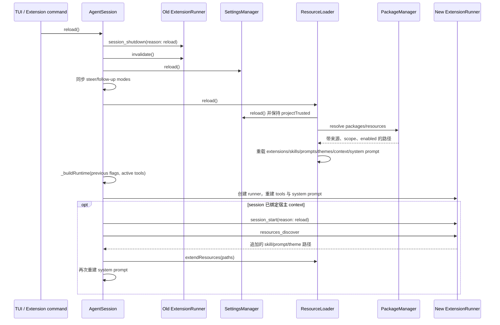

# Settings、资源与 Extension Reload

主负责 package：`pi-coding-agent`。本链路位于 SettingsManager、PackageManager、ResourceLoader、ExtensionRunner 和 AgentSession 之间。

## 1. 两种不同的“重新加载”

- `AgentSession.reload()`：cwd 和 session 不变，重新读取当前项目的设置与资源，并替换 extension runtime/tool registry。
- `AgentSessionRuntime` 的 session replacement：目标 cwd 可能变化，因此创建全新的 `AgentSessionServices` 和 `AgentSession`。

例如，修改当前项目的 prompt 配置后执行 reload，会保留会话历史并重新加载提示模板；恢复另一个目录的会话，则需要为目标目录创建设置、资源和会话对象。

## 2. Session 内 reload 调用链

当前实现中 `AgentSession.reload()` 先显式 reload settings，`ResourceLoader.reload()` 内部还会再次 reload 同一个 manager。后一次是资源解析自身的契约：它需要确保 package 和资源选择基于最新设置，同时保留已经决定的 `projectTrusted` 状态。

## 3. `ResourceLoader.reload()` 实际更新什么

1. 清除 extension module cache。
2. 如需 trust 决策，先仅加载允许参与决策的全局/临时 extensions，再决定是否启用项目设置。
3. reload global/project settings。
4. 由 PackageManager 解析 npm、git、本地和约定目录资源。
5. 按 enabled、scope、source 和优先级生成最终路径。
6. 执行 extension factories，发布新的 `ExtensionRuntime`。
7. 重载 skills、prompt templates 和 themes，并保存来源/冲突 diagnostics。
8. 重新发现 AGENTS/CLAUDE context files、system prompt 和 append system prompt。

extension 的 `resources_discover` 在新 runner 绑定且发出 `session_start` 后执行，因为只有活跃 extension context 才能动态贡献 skill/prompt/theme 路径。它不追加 extension tool；追加的 skill 可能再次改变 system prompt，prompt/theme 则更新各自的资源集合。只有已通过 `bindExtensions()` 建立宿主绑定的 session 才走这一段。

## 4. 为什么必须共享 `SettingsManager`

`ResourceLoader` 创建时持有一个 `SettingsManager`。`AgentSession` 也根据 settings 动态读取 retry、transport、tools、image、queue 等行为。若两者不是同一个实例，会出现：UI/Agent 已看到新设置，但资源解析仍依据旧设置，或相反。

issue #2753 的回归测试覆盖了这个具体场景：启动后修改顶层 prompt 设置并 reload，禁用的 prompt 必须从 session 中消失。`createAgentSessionFromServices()` 保证 loader 和 session 使用同一 manager。

## 5. Extension runtime 为什么需要替换

reload 后 extension 代码、注册的命令、工具、flags 和 hooks 都可能变化。旧 runner 不能原地追加新注册，否则扩展源码中已删除的处理函数和工具可能残留。因此顺序是 shutdown → invalidate → load → new runner → 重新绑定。

flag values 和当前 active tool names 会显式传入新 runtime，保留用户当前选择；extension tools 则从新的注册集合重新生成。

## 6. 必须保持的不变量

- 项目 extension 不能在项目 trust 确认前执行。
- session、resource loader 和 package manager 必须观察同一个有效 settings 状态。
- 旧 runner 必须在新 runner 生效前 shutdown 并 invalidate。
- reload 后不得保留已删除 extension 的 handler、command 或 tool。
- context、skills、prompts、themes 和 system prompt 必须来自同一轮资源解析。

## 7. 源码入口

1. [`agent-session.ts`](../../packages/coding-agent/src/core/agent-session.ts)：`reload()`、`_buildRuntime()` 和动态资源扩展。
2. [`resource-loader.ts`](../../packages/coding-agent/src/core/resource-loader.ts)：`reload()` 的完整资源解析顺序。
3. [`settings-manager.ts`](../../packages/coding-agent/src/core/settings-manager.ts)：global/project 合并与 trust 状态。
4. [`package-manager.ts`](../../packages/coding-agent/src/core/package-manager.ts)：资源来源、scope、filter 和优先级。
5. [`extensions/loader.ts`](../../packages/coding-agent/src/core/extensions/loader.ts) 与 [`extensions/runner.ts`](../../packages/coding-agent/src/core/extensions/runner.ts)：注册收集和运行时 hook。
6. [`2753-reload-stale-resource-settings.test.ts`](../../packages/coding-agent/test/suite/regressions/2753-reload-stale-resource-settings.test.ts)：stale settings 回归。
