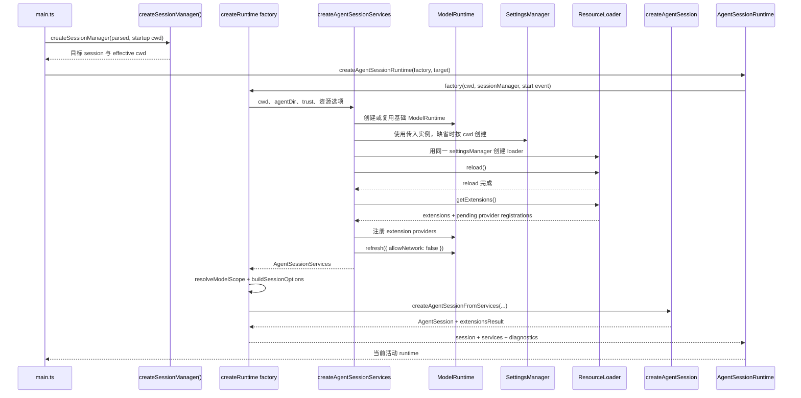

# Runtime 启动与 Session 装配

主负责 package：`pi-coding-agent`。跨包对象：`pi-agent-core` 的 `Agent`、`pi-ai` 的 model/provider。

## 1. 入口与终点

正式 CLI 从 `main(args)` 开始。本链路的终点不是单独的 `AgentSession`，而是同时持有当前 session 和 cwd 绑定 services 的 `AgentSessionRuntime`。

基础 ModelRuntime 先准备内建 provider、凭据与模型配置；随后资源加载执行扩展，services 才注册扩展 provider 并刷新模型视图。CLI 通常在调用 services 前就准备了目标 cwd 的 SettingsManager，因此图中复用设置实例不代表此时才首次读取配置。ModelRuntime 的创建细节见[模型运行时](../03-model-and-auth-runtime.md#21-modelruntime-创建时怎样装配这些对象)，资源发现与信任见[资源与扩展](../04-resources-and-extensions.md)。

## 2. 为什么必须分成两阶段

session 参数依赖 services 的加载结果，不能在 services 之前完整确定：

- `SettingsManager` 决定默认模型、thinking level、工具和项目资源设置。
- `ResourceLoader` 执行 extension factory；extension 可能注册新的 provider 和工具。
- `ModelRuntime` 接收 extension provider 后，才能正确解析 `--models` 或项目默认模型。
- `SessionManager` 的历史决定是恢复原模型，还是选择新的默认模型。

因此顺序必须是“确定目标 cwd → 创建 services → 解析 session options → 创建 session”。`createAgentSessionFromServices()` 本身只是受约束的装配器，它保证传给 `createAgentSession()` 的 cwd、settings、resources 和 model runtime 来自同一组已初始化依赖。

### 2.1 SDK 默认入口与 CLI 的差异

上图描述 CLI 的组装路径。SDK 的 `createAgentSession()` 与它采用相同的整体思路：确定 cwd、准备依赖、解析会话选项、构造会话，但 SDK 默认入口自行补齐依赖，不调用 `createAgentSessionServices()`。

| 环节 | CLI | SDK 直接调用 `createAgentSession()` |
|---|---|---|
| 工作目录 | 先选择或创建会话，以会话的 cwd 创建运行时 | 按显式 `cwd`、传入的 `sessionManager.getCwd()`、`process.cwd()` 的优先级确定 |
| 配置与资源 | 在 services 创建阶段准备，再注入会话工厂 | 使用传入的依赖；缺省时自行创建 settings、model runtime 和 resource loader |
| 项目信任 | 由 CLI 决策，并传入设置实例及资源加载回调 | 不执行 CLI 的信任交互；默认 SettingsManager 的 `projectTrusted` 为 `true` |
| 扩展 provider | services 在模型解析前处理待注册 provider，并刷新模型目录 | 默认入口加载资源后直接进入模型解析，没有执行 services 中的提前注册和刷新步骤 |
| 会话存储目录 | 解析 CLI 参数、环境变量和 `settings.sessionDir` | 未传入 SessionManager 时使用 `getDefaultSessionDir(cwd, agentDir)` |

CLI 最终通过 `createAgentSessionFromServices()` 调用同一个 `createAgentSession()`，复用模型恢复、thinking level 解析以及 `Agent`/`AgentSession` 构造。SDK 调用方也可以显式使用 services/runtime API。这里说明的是当前入口差异，并不表示两套依赖准备流程已经统一。

### 2.2 为什么有两个 SettingsManager

`startupSettingsManager` 与 `runtimeSettingsManager` 是同一类的两个实例。前者绑定启动 cwd，用于首次设置、启动界面、会话目录查询和信任提示；后者在目标会话 cwd 确定后创建，按项目的信任状态提供正式运行所需的配置。

例如，在项目 A 执行 `pi --resume` 后选中项目 B 的历史会话：选择会话之前需要 A 的启动配置，选中之后必须按 B 的目录加载运行配置，不能直接沿用 A 的实例。首次设置发生在运行时依赖创建之前，使已保存的选择能被后续实例读取。

这两个实例用于 CLI 的不同阶段，不是两个后台服务。SDK 默认入口已经能从参数或传入的 SessionManager 确定 cwd，因此没有这套启动实例与运行时实例的划分。

## 3. `AgentSessionServices` 的职责

| 字段 | 处理内容 | 生命周期 |
|---|---|---|
| `cwd` | 项目资源和相对配置的解析根 | effective cwd 改变时更新 |
| `agentDir` | 全局 auth、models、settings 和资源根 | 通常为进程级固定输入 |
| `settingsManager` | global/project 设置合并和 trust gate | 与当前 cwd 绑定 |
| `resourceLoader` | extensions、skills、prompts、themes、context 和 system prompt | 与 settings/cwd 绑定 |
| `modelRuntime` | provider 组合、模型目录、凭据状态和请求入口 | 基础配置来自 agentDir；有效 provider 集合还受当前项目 extension 影响 |
| `diagnostics` | service 创建期间的非致命 info/warning/error | 随本次 runtime 创建返回 |

`SessionManager` 不放在 services 内：它先用于确定 session 文件和 cwd，随后作为本次 session 的状态/持久化依赖单独传入。`AgentSession` 也不属于 services，因为它是这些依赖装配后的产物。

## 4. 固定输入与重建输入

CLI 指定的 extension、skill、prompt 和 theme 路径在启动 cwd 下先转为绝对路径，然后由 factory 闭包复用。这样恢复另一个 cwd 的 session 时，同一条 CLI 路径不会被重新解释。

factory 每次执行时重新处理：

1. 目标 cwd 的 trust。
2. 目标 cwd 的 settings 和 package/resource 集合。
3. extension provider 注册。
4. 当前 session 历史对应的模型恢复和 fallback。
5. model scope、thinking level 和工具选择。

## 5. 诊断与失败边界

services 创建不直接打印或退出。extension provider 注册错误、未知 extension flag 等先进入 `diagnostics`；`main()` 再合并 settings、resource 和 session-option diagnostics，由应用层决定展示和退出。创建函数可以抛出的结构性错误则继续向上传播。

这种分层允许 SDK 选择不同错误策略，也避免基础设施函数依赖 CLI 输出。

## 6. CLI 运行时组装必须保持的不变量

- `services.cwd` 必须等于 `sessionManager.getCwd()` 所代表的有效项目目录。
- `AgentSession` 与 `ResourceLoader` 必须共享同一个 `SettingsManager`。
- extension provider 必须在模型 scope 和默认模型解析之前注册。
- 跨 cwd 恢复不能复用旧 cwd 的 settings 或 resource loader。
- CLI 相对资源路径只能在初始 CLI cwd 下解析一次。

## 7. 源码入口

1. [`main.ts`](../../packages/coding-agent/src/main.ts)：`createSessionManager()`、`createRuntime` factory 和 mode 交接。
2. [`agent-session-services.ts`](../../packages/coding-agent/src/core/agent-session-services.ts)：services 创建以及 `createAgentSessionFromServices()`。
3. [`sdk.ts`](../../packages/coding-agent/src/core/sdk.ts)：最终 `Agent`、`AgentSession` 和默认依赖的装配。
4. [`agent-session-runtime.ts`](../../packages/coding-agent/src/core/agent-session-runtime.ts)：保存 factory，并在后续替换时复用。
