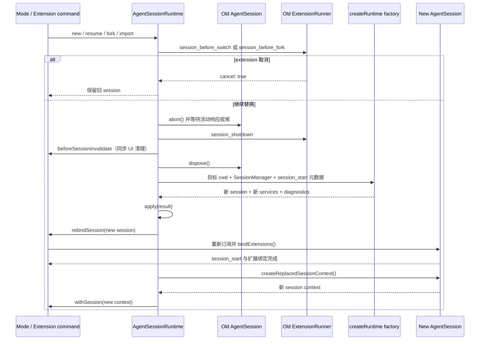

# Session 替换调用链

主负责 package：`pi-coding-agent`。跨越边界：interactive、print 和 RPC 等 mode 宿主需要重新绑定新 session。

## 1. 什么操作会进入这条链

`AgentSessionRuntime` 统一处理 `newSession()`、`switchSession()`、`fork()` 和 `importFromJsonl()`。这些操作不是修改当前 `AgentSession.messages`，而是替换当前 session；目标 session 还可能属于另一个 cwd。

## 2. 统一替换顺序

`abort()` 必须先完成，因为被中止 turn 中已经完成的 user、assistant 或 tool result 需要先经事件处理写入旧 session。`session_shutdown` 必须发生在旧 runner 仍有效时；宿主 UI 的同步清理必须发生在旧 extension context 失效之前。

## 3. 各操作的差异

| 操作 | SessionManager 来源 | cwd |
|---|---|---|
| `newSession()` | 当前 session dir 中新建，或新的 in-memory manager | 保持当前 cwd |
| `switchSession(path)` | 打开目标 JSONL | 读取目标 session header，可显式 override |
| `fork(entryId)` | 持久 session 创建 branched file；in-memory session 原地创建分支 | 通常保持来源 cwd |
| `importFromJsonl(path)` | 复制到当前 session dir 后打开 | 读取导入文件，可显式 override |

恢复或导入时会先验证目标 cwd 是否存在。fork 还要区分选中 entry 之前和包含该 entry 两种位置，并把需要恢复到编辑器的用户文本返回给宿主。

## 4. 所有权变化

`AgentSessionRuntime` 是稳定引用；内部的 `session`、`services`、`diagnostics` 和 `modelFallbackMessage` 会整体替换。调用方不能长期缓存旧 `AgentSession`、extension context 或 resource loader。`session_start` 不是 factory 创建 session 时自动发出；它由宿主在 `rebindSession` 期间调用 `bindExtensions()` 时发出。

宿主通过两种回调参与替换：

- `beforeSessionInvalidate`：同步解绑旧 extension 提供的 TUI 组件，不能等待异步间隙。
- `rebindSession`：对新 session 重新订阅事件并绑定 extension UI。

extension 命令若要在替换后继续操作，必须使用 `withSession` 收到的新 context，不能继续使用触发替换的旧 context。

## 5. 失败与一致性

- before 事件取消时，旧 runtime 完全保留。
- teardown 之后若新 runtime 创建失败，错误向宿主传播；旧 session 已被 dispose，不进行隐式回滚。
- `apply()` 一次替换 session、services 和 diagnostics，避免新旧对象交叉组合。
- 新 runtime 创建成功后才执行 rebind 和 `withSession`。

## 6. 必须保持的不变量

- 同一时刻只有一个活动 `AgentSession`。
- 旧 session 的活动响应必须在 dispose 前 settle。
- 旧 extension context 和 UI 绑定不得进入新 session。
- 新 services 必须按目标 session 的 cwd 重建。
- 替换后的调用必须重新读取 `runtime.session`，不能使用缓存引用。

## 7. 源码入口

1. [`agent-session-runtime.ts`](../../packages/coding-agent/src/core/agent-session-runtime.ts)：全部替换操作、teardown、apply 和 rebind。
2. [`agent-session-services.ts`](../../packages/coding-agent/src/core/agent-session-services.ts)：目标 cwd 的 services 重建。
3. [`interactive-mode.ts`](../../packages/coding-agent/src/modes/interactive/interactive-mode.ts)：UI 如何注册 replacement callbacks 并绑定新 session。
4. [`agent-session-runtime-events.test.ts`](../../packages/coding-agent/test/agent-session-runtime-events.test.ts)：切换事件顺序。
5. [`agent-session-branching.test.ts`](../../packages/coding-agent/test/agent-session-branching.test.ts)：fork/branch 行为。
