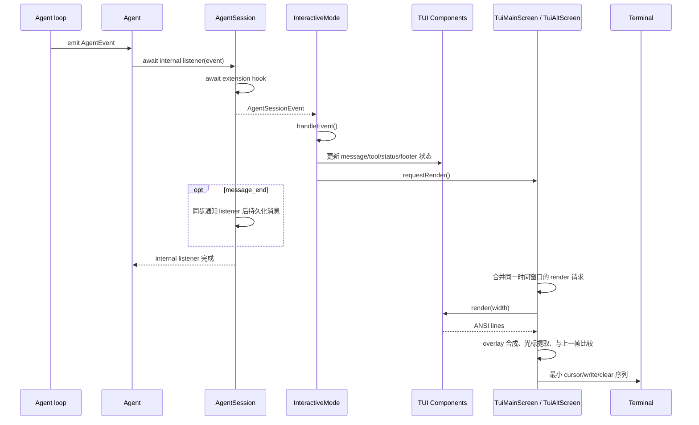

# TUI 输入、事件与渲染调用链

主负责 package：`pi-coding-agent` 的 `InteractiveMode` 与 `pi-tui`。`AgentSession` 是业务事件边界。

## 1. 输入方向

```text
Terminal input
→ pi-tui TUI.handleTerminalInput()
→ focused component / Editor.handleInput()
→ InteractiveMode 的 submit handler
→ AgentSession.prompt()
→ Agent / agent-loop
```

`pi-tui` 只负责解析终端输入并投递给 focused component，不理解 prompt、streaming 或 extension command。`InteractiveMode` 读取编辑器文本后决定产品行为：compaction 期间排队、streaming 期间以 steer 提交，否则作为普通 prompt。

## 2. 输出方向



`InteractiveMode.handleEvent()` 是产品事件到组件状态的映射点。`pi-tui` 不订阅 Agent；它只在被请求时读取组件树并渲染。

renderer 由 coding-agent 的 `createInteractiveTui()` 创建；fullscreen 根布局由 `createChatViewport()` 组合 transcript 和固定 dock。这两个 helper 也被实验性 client presentation 复用，但该路径从 Chord `Transcript` replica 更新组件，不订阅 `AgentSessionEvent`。

工作、compaction、branch summary 和 retry 共用 `StatusIndicator`。支持边框嵌入的 editor 会显示活动 indicator；否则它位于 status container。renderer/editor 重建时，`InteractiveMode` 会让所有 indicator 重新选择位置，不只处理 working spinner。

## 3. 为什么 `requestRender()` 不立即输出

模型 streaming 会在很短时间内产生大量 delta，工具和 footer 也可能同时失效。每次状态变化立即全量输出会造成闪烁、重复 ANSI 写入和 scrollback 破坏。

`requestRender()` 合并重复请求，并受最小 render interval 限制。强制 render 会清理上一帧状态并走即时调度，主要用于尺寸或显示模式发生结构变化时。正常 render 仍由组件的 `render(width)` 生成完整逻辑帧，再由 renderer 计算最小终端更新。

## 4. 一次 render pass 的关键步骤

1. 按 terminal width 渲染根组件树。
2. 根据 fullscreen/regular 模式确定 viewport。
3. 按 focus order 渲染并合成可见 overlays。
4. 查找 focused component 放置的 `CURSOR_MARKER`，换算 Unicode 可见列并移除标记。
5. 规范化 ANSI reset 和终端行。
6. 与上一帧比较，仅输出必要行、cursor movement 和清理序列。
7. 把硬件光标移动到最终输入位置。

组件改变缓存状态后调用 `invalidate()`；改变可见状态后调用 `requestRender()`。二者用途不同：前者让下次 render 重算内容，后者安排一次 render pass。

## 5. Session 替换时的重绑

`InteractiveMode` 长期持有 `AgentSessionRuntime`，但不能长期持有旧 session 的订阅。runtime 替换前同步移除旧 extension UI；替换后：

1. 取消旧 session subscription。
2. 更新 settings/resource/session 引用。
3. 订阅新 session events。
4. 为新 extension runner 创建 UI context 并执行 `bindExtensions()`。
5. 根据新 session 历史和资源重建组件状态。

如果跳过重绑，旧 session 的异步事件可能继续更新当前 UI，新 extension 也会拿到失效的 context。

## 6. 失败与背压边界

- `Agent` 会 await `AgentSession` 注册的内部 listener，因此 extension hook 和持久化会在 run settle 前完成。`AgentSession.subscribe()` 的宿主 listener 是同步调用，其返回的 Promise 不会被等待。
- `requestRender()` 只合并视觉刷新，不丢弃业务事件；组件状态仍按事件顺序更新。
- terminal 尺寸、宽字符、图片行和 overlay 可能使文本索引不等于屏幕列，所有裁剪和光标定位必须使用 visible width。
- TUI 停止后调度器不得继续写 terminal。
- 异步树导航在改写 leaf、status 或 escape handler 前必须再次确认没有 compaction/其他导航启动；`AgentSession.navigateTree()` 提供第二层互斥检查。

## 7. 必须保持的不变量

- `pi-tui` 不依赖 Agent 或 coding-agent 业务类型。
- 同一时刻只有 focused component 接收普通输入。
- event 顺序不能被 render throttling 改变。
- overlay 的视觉层级与 focus restore 状态必须一致。
- session replacement 后所有事件订阅和 extension UI context 必须指向新 session。

## 8. 源码入口

1. [`interactive-mode.ts`](../../packages/coding-agent/src/modes/interactive/interactive-mode.ts)：submit handler、`subscribeToAgent()`、`handleEvent()`、extension binding 和 session rebind。
2. [`agent-session.ts`](../../packages/coding-agent/src/core/agent-session.ts)：Agent event 到产品 event、extension 和持久化的顺序。
3. [`tui.ts`](../../packages/tui/src/tui.ts)：input dispatch、`requestRender()`、render scheduling、overlay 和 cursor 处理。
4. [`tui-renderer.ts`](../../packages/coding-agent/src/modes/interactive/tui-renderer.ts) 与 [`chat-viewport.ts`](../../packages/coding-agent/src/modes/interactive/chat-viewport.ts)：产品 renderer 配置和 fullscreen layout。
5. [`status-indicator.ts`](../../packages/coding-agent/src/modes/interactive/components/status-indicator.ts)：活动操作状态怎样在独立容器与 editor 边框间复用。
6. [`editor.ts`](../../packages/tui/src/components/editor.ts)：focused editor 如何解释按键并触发提交。
7. [`04-tui-rendering-architecture.md`](../package-docs/04-tui-rendering-architecture.md)：TUI 包内部渲染模型的补充说明。
