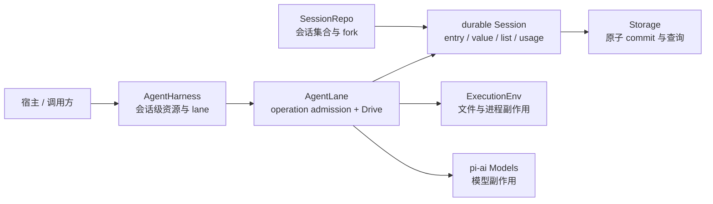

# AgentHarness：durable runtime 与剩余切片

来源：`packages/agent/docs/harness.md`，并以 `packages/agent/src/harness/` 当前源码校正完成度。规范中明确标记为 design-only 或 not implemented 的部分不写成当前保证。

## 1. 先看结论

`AgentHarness` 已从数据结构外壳变成可运行的 durable Agent runtime：

| 范围 | 当前状态 |
|---|---|
| durable Session、JSONL/内存/SQLite 后端与 conformance | 已实现 |
| lane 获取/创建、run、compaction、navigation、resume、abort 与队列 | 已实现 |
| provider/tool checkpoint、retry、deferred response、工具落位与 terminal result | 已实现 |
| lane event/hook、`watch()` snapshot + 增量 | 已实现 |
| 显式 Context 与 typed telemetry schema | Context 已贯穿；大多数 runtime span 尚未接线 |
| session 级 `watchSession()` | 唯一公开 stub，抛出 `SliceNotImplemented` |
| JSONL 物理 snapshot compaction、search、未来格式迁移 | 规范已描述，尚未实现或尚未激活 |

它仍未替代正式 `AgentSession`。默认 CLI/SDK 继续走产品会话；coding-agent 的实验性 session worker 已实际创建 `AgentHarness` 并通过 Chord service 暴露 lane 控制和 transcript。

## 2. 它真正解决的问题

普通 `Agent` 把一次模型—工具循环保存在内存里。持久运行的 Agent 还必须判断进程中断时外部效果进行到哪里。假设 shell 已删除文件，但 tool result 尚未提交；重启后只看聊天消息，无法知道应该重放还是跳过。

Harness 因此把会话操作建模为可持久恢复的状态机。会话同时保存对话树、lane 配置/状态、operation program counter、assistant frame、工具参数/输出、usage 和最终结果。恢复直接读取 operation state，不从残缺 transcript 反推进度。

## 3. 三条边界各自解决什么



`ExecutionEnv` 统一文件系统、shell、路径和临时文件能力，使同一 Harness 可以运行在 Node、本地替身或自定义环境。它不保存状态。

`Storage` 是单会话原子边界：一次 commit 可同时写 entry、value、list element 和 usage。`Session` 在其上提供 mutation line、branch、名称与标签；`SessionRepo` 管理会话集合和 branch/tree fork。

`AgentHarness` 保存共享 tools、resources、stream/retry/compaction 配置并管理 lane；`AgentLane` 接纳和驱动 run、compaction、navigation。一个 lane 同时绑定同名 branch、总配置和 durable lane state，每条 lane 最多一个 active operation。

## 4. 外部效果为什么要前后各提交一次

运行时围绕 provider/tool 效果建立 durable checkpoint：

```text
提交 effect-pending 状态、稳定 ID 和必要输入
    ↓
执行 provider 或工具
    ↓
提交 frame / tool output / usage 与下一 operation state
```

崩溃发生在中间时，恢复代码知道哪一种效果处于不确定窗口。provider attempt 使用稳定请求标识和 retry state；工具按 replay policy 处理，安全工具可以重放，不可重放工具生成 synthetic interrupted result。结果不是 exactly-once，但不确定性被显式限制，且不会盲目重复全部副作用。

`Drive` 是唯一顶层状态推进写者。terminal transaction 先把 lane 切回 idle 并确定结果，再单独写不可变 `OperationResultRecord`；调用方可用 operation ID 查询最终结果，即使原调用连接已经断开。

## 5. 为什么不能把所有内容写成一种日志记录

当前实现已经采用与数据寿命相匹配的四种 write：

- immutable entry：message、compaction、branch summary 和 custom 历史节点。
- replaceable value：branch tip、lane config/state、operation meta/state/result 和工具 memo。
- append-only list：assistant frames、pending tool output 等有序增量。
- usage row：独立的 token/cost 累计与 adjustment。

这些 write 在同一 sequence 空间内原子提交。operation 结束后可删除临时 value/list，而 transcript entry 与 usage 保留；恢复只读当前 program counter，不必扫描整段历史猜测状态。

## 6. 多后端与公共行为测试的意义

JSONL、内存和 SQLite 用途不同，但共享 `Storage` 与 `SessionRepo` 语义。`createStorageConformance()` 固定原子写入、sequence、value/list、usage 和 branch scan；`createSessionRepoConformance()` 固定生命周期、所有权、消息与 fork 行为。

JSONL v4 采用 header + committed writes；尾行损坏可修复，fork 通过临时文件原子发布。SQLite 将同一逻辑映射为事务表。规范中的 JSONL snapshot compaction 尚未实现，因此逻辑删除不会立即回收历史 write 的物理字节。

## 7. Lane 的运行语义

lane 不是另一份 session。它是在共享会话树上拥有独立 branch tip、配置、inbox 和 operation 的执行单元。`AgentHarness.lane(name)` 可取得既有 lane，也可通过带配置的 acquire 创建新 lane；`lanes()` 列出当前 lane。

`accept()` 原子接纳 run/compaction/navigation；高层 `prompt()` 等方法随后调用 `drive()`。steer、follow-up、next-run 与 write 进入 durable inbox，并按 checkpoint 规则取出。`watch()` 先生成完整 `LaneSnapshot`，订阅者调用 `start()` 后再释放 hydration 期间缓冲的更新，从而避免 snapshot 与增量之间出现空窗。

## 8. 与正式 AgentSession 的关系

正式 CLI/SDK 使用 `AgentSession`、`SessionManager`、旧 extension 系统和产品 compaction。Harness 使用 durable `Session`、`AgentLane`、Harness hook/event 与 `ExecutionEnv`。二者共享 `pi-ai` 和部分问题域，但格式、扩展模型和生命周期独立。

实验性 client/server 路径不是把 `AgentSession` 放到网络后面，而是在每会话 worker 中创建 Harness，并用 Chord facets 提供 `AgentController`、`Transcript`、`Models` 等服务。这个接入证明 Harness 已可运行，但不改变默认产品入口的稳定性标记。

## 9. 具体实现

1. 读 [`agent-harness.ts`](../../packages/agent/src/harness/agent-harness.ts)，确认公开 `AgentHarness`、`AgentLane`、snapshot、event 和 hook 契约。
2. 读 [`runtime/harness.ts`](../../packages/agent/src/harness/runtime/harness.ts) 与 [`runtime/lane.ts`](../../packages/agent/src/harness/runtime/lane.ts)，确认 lane 生命周期、admission、drive、恢复和 watch。
3. 读 [`runtime/drive/`](../../packages/agent/src/harness/runtime/drive)，按 assistant、tools、checkpoint、recovery 和 terminal 拆分理解状态推进。
4. 读 [`session/types.ts`](../../packages/agent/src/harness/session/types.ts)、[`session/values.ts`](../../packages/agent/src/harness/session/values.ts) 与 [`session/session.ts`](../../packages/agent/src/harness/session/session.ts)，确认存储和 mutation line。
5. 最后读 [`harness.md`](../../packages/agent/docs/harness.md) 的 0.9 节，区分已实现机制与剩余切片。
