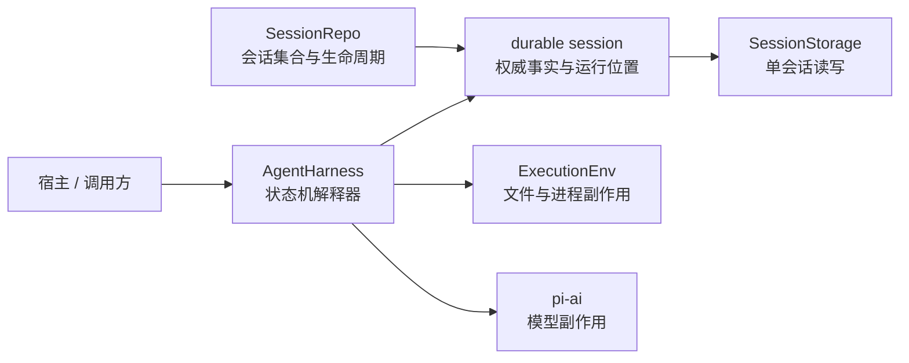

# AgentHarness：当前实现与目标规格

来源：`packages/agent/docs/harness.md`，并以 `packages/agent/src/harness/` 当前源码校正完成度。Future、build order 和 open questions 不作为当前事实。

## 1. 先看结论

`harness.md` 是 durable Agent runtime 的实现规格，不是“当前全部已经完成”的说明。当前状态应拆成两部分：

| 范围 | 当前状态 |
|---|---|
| durable session 类型、树、record、lane、JSONL/内存/SQLite 后端 | 已实现并有公共行为测试 |
| compaction、branch summary、工具、prompt/skill、reducer、telemetry 等辅助模块 | 已有实现 |
| `AgentHarness` 配置 getter/setter、基础 session 访问 | 已实现 |
| `prompt`、`compact`、`resume`、`abort`、队列、lane、watch、完整恢复与执行驱动 | 返回 `HarnessNotImplemented` |

所以它不能被描述为已完成、可替代 `AgentSession` 的独立运行时，也不在正式 `pi` 请求路径中。

## 2. 它真正要解决的问题

普通 `Agent` 可以把一次模型—工具循环保存在内存里，但持久运行的 Agent 会遇到一个更难的问题：模型请求、shell 命令和文件修改发生在外部世界，而进程内状态随时可能丢失。假设工具已经删除文件，进程却在 tool result 写入会话之前退出；重启后只看聊天消息，无法判断工具是“尚未执行”还是“执行完成但结果未保存”。盲目重试可能再次删除，直接跳过又会留下没有结果的 tool call。

Harness 规格因此把 Agent 定义成一个**可持久恢复的状态机**：会话不仅保存对话，还保存当前 operation 已走到哪一步、下一步准备产生什么效果，以及恢复时允许怎样处理。核心目标是让重启后的程序读取明确状态继续，而不是从残缺历史猜测进度。

## 3. 三条边界各自解决什么



`ExecutionEnv` 统一文件系统和 shell 能力。它的意义不是把 Node API 换个名字，而是让 Harness 明确知道哪些调用会触碰外部世界，并让同一套工具可以运行在本机 Node、自定义执行环境或内存测试替身中。它不保存 Agent 状态，也不负责恢复。

durable session 是恢复依据。当前已实现的数据模型包含 entry、record、lane 和 fact：entry 构成对话树；record 记录 operation 等不直接进入模型上下文的事实；lane 指向树上的活动叶子；fact 保存名称和标签等可更新元数据。Harness 规格进一步把 operation 的完整当前状态作为 durable program counter：恢复时直接读取当前阶段，而不是倒推“最后可能执行了什么”。

`SessionStorage` 只处理一个已经打开的会话，提供追加、lane 移动和查询；`SessionRepo` 处理会话集合，负责 create、list、open、delete 和 fork。这个边界允许 `list()` 只读取 metadata，不获取 writer claim，而 `open()` 可以让 SQLite 等后端建立单写者租约。`Session` 位于二者之上，把 storage 包装为带活动 lane 的类型化会话树视图。

`AgentHarness` 的目标角色是解释器：读取 durable operation state，选择下一步，调用模型或 `ExecutionEnv`，再提交结果和后继状态。它不是另一种存储，也不是 coding-agent 的 UI 层。当前这个解释器尚未接通，已完成的是其周围的大量数据结构和辅助模块。

## 4. 外部效果为什么要前后各提交一次

规格的核心执行规则是：每次外部效果前后都持久化完整 operation 状态。

```text
提交意图：即将调用模型或工具，预留结果 ID
    ↓
执行外部效果：真正的 provider 请求或工具调用
    ↓
提交结果：结果、usage 和下一状态一起落盘
```

崩溃若发生在两个提交之间，恢复代码至少能确定“效果可能发生过，但结果未确认”。这仍然不是 exactly-once：模型可能已经计费，外部系统也可能已经修改，Harness 无法用本地事务回滚它们。但不确定性被限制在一个有明确记录的窗口里。对于工具，再根据 `replay: safe | never` 决定重放只读操作，还是写入 synthetic interrupted result，避免危险操作重复执行。

这是一种目标设计，不应误写成当前 `AgentHarness.prompt()` 已经完成了这条流程。当前源码仍未接通执行驱动。

## 5. 为什么不能把所有内容写成一种日志记录

对话历史是长期事实，应该追加而不覆盖；operation state 是当前程序计数器，需要替换或删除；usage 是独立累计账本。三者变化规律不同，分开后可以满足：

- 历史分支共享前缀，不复制整段对话。
- operation 完成后清理临时状态，而不污染对话树。
- 恢复读取当前状态，不必扫描整段历史推断缺了什么。
- 搜索索引、分支缓存和统计可以作为可重建派生数据。

目标规格因此将其分别建模为不可变 entry、可覆盖的 register 和追加式 usage ledger。

当前实现尚未完全等同于目标规格使用的三存储模型；当前 session API 暴露的是 entry、record、lane 和 fact。文档必须区分“规格希望怎样完成恢复”与“源码现在已经提供什么”，不能把目标 register/ledger 设计写成已接通的运行事实。

## 6. 多后端与公共行为测试的意义

JSONL、内存和 SQLite 的目的不同：JSONL 适合简单本地持久化，内存实现适合测试或临时宿主，SQLite 适合事务、查询和 writer lease。它们共享 `SessionRepo`/`SessionStorage` 语义，才可以在不改上层 session 代码的情况下选择介质。

`createSessionBackendConformance()` 会针对每个后端生成同一组行为测试，例如追加 entry 后的 parent/seq、lane 移动、fork 范围、查询结果和错误码。这里的 conformance 是“符合共同约定”：测试保障调用方看到的会话行为一致，不要求三个后端内部结构相同，也不等于 Harness 的 run/recovery 已经完成。

## 7. Lane 的目标用途

lane 不是另一份 session。它是在同一会话树上的独立活动指针，可用于并行线程、子任务或其他共享历史的工作流。每个 lane 最多有一个活动 operation，以 lane mutation line 串行化状态相关修改。

当前 durable session 已有 lane 数据结构，但 `AgentHarness.createLane()`、`lane()` 和 `lanes()` 尚未实现。因此这里只能称为已定义的数据模型和目标调度语义。

## 8. 与正式 AgentSession 的关系

正式 CLI/SDK 当前使用 coding-agent 的 `AgentSession`、`SessionManager` 和产品压缩实现。Harness 工程复用了相同的问题域，但格式和运行入口独立。源码没有承诺它将替换 `AgentSession`，也没有一条 `Agent → AgentHarness → AgentSession` 的继承链。

## 9. 具体实现

1. 读 [`agent-harness.ts`](../../packages/agent/src/harness/agent-harness.ts)，确认公开操作与 `HarnessNotImplemented` 边界。
2. 读 [`session/types.ts`](../../packages/agent/src/harness/session/types.ts) 与 [`session/session.ts`](../../packages/agent/src/harness/session/session.ts)，确认 Harness 周围已经可用的 durable session 能力。
3. 最后读 [`harness.md`](../../packages/agent/docs/harness.md) 理解目标设计，不要用目标规格替代当前实现。
