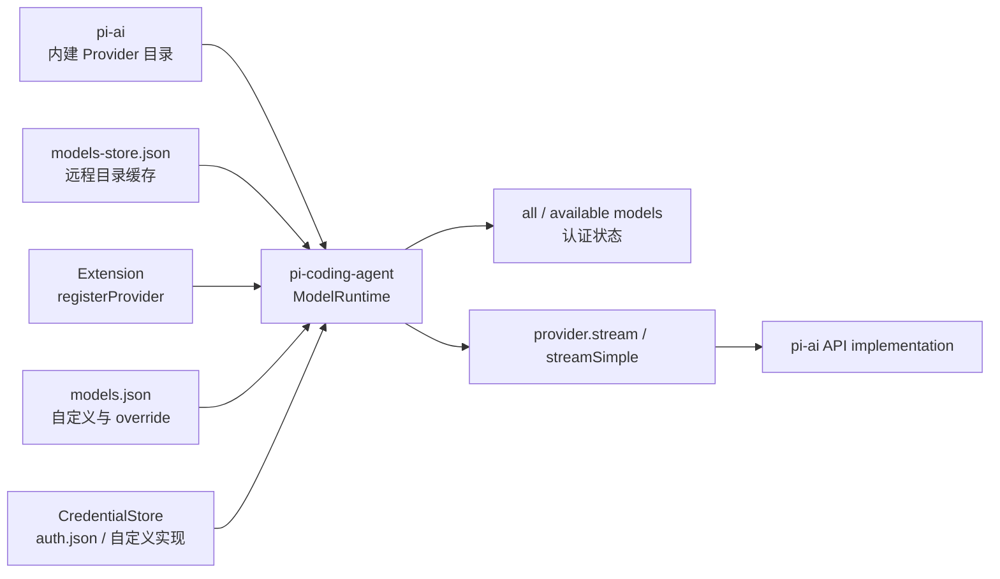

# 模型目录、Provider 组合与认证边界

来源：`models.md`、`custom-provider.md`、`providers.md` 和 `sdk.md`，并核对 `core/model-runtime.ts`、`provider-composer.ts` 与 `auth-storage.ts`。排除登录步骤、云厂商环境变量、配置字段全集和自定义 stream 实现教程。

## 1. 先区分四个概念

- model 是一次请求使用的静态描述，包括 provider、API 类型、上下文窗口、输入能力和兼容性参数。
- provider 拥有一组 model，并负责认证方式、目录刷新、模型过滤和请求流入口。
- API implementation 把统一的 Pi 消息转换成 Anthropic、OpenAI、Google 等具体 wire protocol，再把供应商流转换回统一事件。
- credential 是 provider 请求所需的 API key 或 OAuth 状态，不属于 model 定义。

因此 `pi-ai` 不是只有一个“模型调用函数”。它定义上述公共类型、内建 provider/API 实现和统一流事件；coding-agent 的 `ModelRuntime` 再把产品配置、凭据和动态注册组合到这些能力上。

## 2. ModelRuntime 是 coding-agent 的组合点

`ModelRuntime` 维护可变 provider 集合和对外只读 snapshot。内建目录提供起点；支持刷新目录的 provider 可以把结果写入 models store，离线时再从缓存恢复；扩展可以注册完整 `Provider`，也可以用兼容配置修改 provider；`models.json` 提供用户模型、provider 配置和逐模型 override。

这条链与 `AgentSession` 分开：列出模型、登录或刷新目录时不必先运行 Agent；真正发请求时，`AgentSession` 只向 runtime 取得模型与 stream 能力。`ModelRegistry` 是面向既有 SDK/扩展接口的包装，权威组合状态在 `ModelRuntime`。

## 3. 组合顺序不是简单覆盖整个对象

`composeModelProvider()` 按 provider ID 合成来源。模型列表先以内建 provider 为基础，加入 `models.json` 的自定义模型，再应用 extension 注册的模型行为；`models.json.modelOverrides` 最后逐模型应用。endpoint、header、认证和 stream handler 也各有自己的合并规则，不能用一句“后加载者覆盖前者”概括。

完整原生 `Provider` 与兼容配置的能力不同。前者可以拥有认证、动态目录、过滤和自定义 streaming；后者适合复用已有 API implementation，只替换 endpoint、header、模型列表或兼容参数。若 model 的 API 既不由该 provider 自己处理，也没有注册到 pi-ai 的 API registry，请求会明确失败，而不是猜测一个 OpenAI 兼容协议。

## 4. 认证为何独立于模型目录

模型“存在”与“当前可调用”是两种状态。provider 可以公开目录，但没有可用 credential；同一 credential 还可能来自 CLI 临时 key、`auth.json`、环境变量或 provider 配置。`ModelRuntime` 因此同时维护 `all` 和 `available`，并在 credential 改变后重新计算认证状态和模型过滤结果。

`CredentialStore` 隔离凭据持久化，默认实现是 `AuthStorage` 对 `auth.json` 的封装；SDK 可以注入其他实现。OAuth refresh 属于 provider auth 行为，存储只保存 credential。模型目录缓存 `models-store.json` 不保存 credential，两者不能混为一个配置文件。

## 5. 请求时才解析动态值

provider/model header 和 API key 可以引用环境变量或命令。目录展示只判断是否配置，不应为了打开模型选择器执行任意凭据命令；真正请求时才解析需要的值并组装 header。这样模型发现不会意外触发外部命令，也允许短期 credential 在请求边界更新。

## 6. 统一流是 provider 的关键契约

不同供应商的 wire format 最终都要产生相同的 assistant stream：start，随后 text/thinking/tool-call block 的 start、delta、end，最后 done 或 error。`Agent` 和上层 UI 只依赖这套事件，不直接理解 SSE payload、WebSocket frame 或厂商 JSON。

这也是自定义 provider 最重要的边界：它不是只返回最终字符串，而必须维护 partial `AssistantMessage`、content index、usage、stop reason 和唯一终态。具体怎样注册和实现属于原始教程，不在本架构文档重复。

供应商级包装可以横跨多种 API implementation。OpenCode/OpenCode Go 把 `sessionId` 统一映射为 `x-opencode-session`；OpenRouter 的兼容元数据则让 Chat Completions 与 Anthropic Messages 使用 `x-session-id`。同理，Fireworks Messages 通过模型兼容元数据声明 deferred tool reference 与 adaptive thinking，而不是让 `Agent` 按 provider 名称分支。

## 7. 具体实现

1. 读 [`types.ts`](../../packages/ai/src/types.ts) 与 [`models.ts`](../../packages/ai/src/models.ts)，确认公共模型、provider 和认证接口。
2. 选择 [`providers/anthropic.ts`](../../packages/ai/src/providers/anthropic.ts)，再进入 [`api/anthropic-messages.ts`](../../packages/ai/src/api/anthropic-messages.ts)，确认 provider 组合与网络协议适配的分界；跨 API provider wrapper 可对照 [`providers/opencode-headers.ts`](../../packages/ai/src/providers/opencode-headers.ts)。
3. 读 [`model-runtime.ts`](../../packages/coding-agent/src/core/model-runtime.ts) 与 [`provider-composer.ts`](../../packages/coding-agent/src/core/provider-composer.ts)，确认产品怎样合并内建、配置和 extension provider。
4. 读 [`auth-storage.ts`](../../packages/coding-agent/src/core/auth-storage.ts)，确认 coding-agent 怎样实现凭据存储边界。
