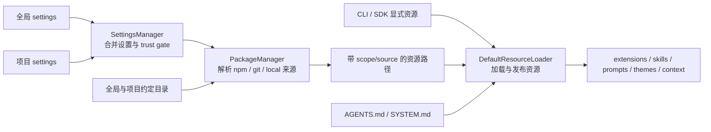

# 设置、Package 与资源解析链

来源：`settings.md`、`packages.md`、`usage.md`、`security.md` 和 `sdk.md`，并核对 `settings-manager.ts`、`package-manager.ts` 与 `resource-loader.ts`。排除安装命令、配置字段全集、package 制作步骤和资源编写教程。

## 1. 三个组件不是同一层



`SettingsManager` 决定当前有效设置；`PackageManager` 同时解析设置中的 package source 和全局/项目约定目录，产生带来源与启用状态的路径；`DefaultResourceLoader` 再合并这些路径与 CLI/SDK 显式输入，并加载具体内容。package 不是第五种运行时扩展，它只是 extensions、skills、prompts 和 themes 的分发容器。

## 2. 全局与项目设置先经过信任边界

全局 settings 对所有项目生效。CLI 正式运行时按当前 cwd 的信任状态加载项目 `.pi/settings.json`；`SettingsManager` 收到 `projectTrusted: false` 时跳过整个项目设置文件，资源加载器也按信任状态限制受保护项目资源。嵌套配置通常深度合并，但资源数组和少数产品字段有各自覆盖规则，不能假设所有数组都会拼接。

这个信任决策由调用方提供，`SettingsManager` 本身不询问信任，省略 `projectTrusted` 时默认值为 `true`。CLI 的 `startupSettingsManager` 默认读取启动目录配置，用于首次设置、启动界面和会话选择；目标 cwd 确定后，再创建带信任状态的 `runtimeSettingsManager`。SDK 默认入口也不会自动执行 CLI 的信任流程。两阶段配置与入口差异见[启动调用链](../call-flows/runtime-bootstrap.md#21-sdk-默认入口与-cli-的差异)。

深度合并发生在派生值解析之前。具体例子是 `compaction.modelOverrides`：全局与项目对象先递归合并，再以精确、区分大小写的 `provider/modelId` 查找。`reserveTokens` 与 `keepRecentTokens` 各自按“模型覆盖 → 普通设置 → 内建默认值”回退；全局的模型专用值会胜过项目的普通 fallback，项目若要改变它必须覆盖同一模型项。

交互模式可以向用户询问信任；print、JSON 和 RPC 等非交互模式不能弹窗，只能依据已保存决定、全局 fallback 或本次显式 override。trust 控制是否加载项目输入，不限制加载后的代码权限。扩展一旦执行，仍拥有宿主进程权限。

### 2.1 SettingsManager 先看三份状态，再看一条写入链

这个类较长，一部分是配置字段多，另一部分是它需要区分“从哪里读取”“当前读到什么”和“写回哪里”。先理解下面几份状态，再按需查 getter/setter，不必从头逐个读字段。

| 状态 | 用途 |
|---|---|
| `globalSettings` | 全局配置的内存副本，普通 setter 修改这里 |
| `projectSettings` | 项目配置的内存副本，`setProject*` 修改这里；项目不可信时不加载 |
| `settings` | 前两者合并后的读取视图，大多数 getter 从这里取值，再补默认值 |
| `modifiedFields` / `modifiedNestedFields` | 记录需要写回的全局字段或直接子字段；项目侧有对应的两份记录 |
| `writeQueue` | 串行执行待写入任务；`flush()` 等待队列完成 |

例如，全局 `compaction` 是 `{ enabled: true, reserveTokens: 16384 }`，项目只设置 `{ reserveTokens: 8192 }`。调用 `setCompactionEnabled(false)` 后：

```text
setCompactionEnabled(false)
  → 修改 globalSettings.compaction.enabled
  → markModified("compaction", "enabled")：只标记这个子字段
  → save()：立即重新合并，getter 读到 false 和 8192
  → 保存当前配置及修改标记的快照，加入 writeQueue
  → persistScopedSettings()：读取存储当前内容，只写回标记的字段
```

写回的是全局 `enabled: false`，项目的 `8192` 不会被复制进全局文件。保存时重新读取存储内容，是为了保留其他进程对未修改字段的更新；否则用启动时的整份副本覆盖文件，会丢掉别人刚改的 `reserveTokens`。这里的写入合并只按标记的字段或直接子字段进行，与读取时的递归深度合并不同。

这也解释了一个容易困惑的现象：普通 setter 改的是全局值。如果项目显式设置了同一字段，随后 getter 仍返回项目值。

### 2.2 阅读顺序与几个容易误判的边界

建议先读 `fromStorageWithPaths()` → `loadFromStorage()` → `deepMergeSettings()`，了解加载与合并；再沿上面的 setter 链读到 `persistScopedSettings()`。其余 getter/setter 按具体配置查阅即可。`SettingsStorage` 负责原始 JSON 的读取与写回，回调返回 `undefined` 表示只读；文件实现处理锁和文件操作，内存实现供 SDK 与测试使用。

- **临时覆盖不是独立保存的一层。** `applyOverrides()` 只改当前 `settings`，不写入两份来源配置。后续 setter 保存、`reload()` 或信任状态变化重新合并时，覆盖会消失；调用方若仍需要它，必须重新应用。
- **内存生效与写入完成是两个时刻。** setter 返回时读取视图已更新，写入任务仍可能排队。`flush()` 等待队列，但写入失败被收集到错误列表，调用方还需用 `drainErrors()` 取出并清空这些错误。
- **加载失败不会拿空配置覆盖坏文件。** 首次加载失败时该 scope 使用空配置；`reload()` 失败时保留该 scope 原有内存值。失败状态会阻止该 scope 的保存，直到成功重新加载。`reload()` 先等待已有写入，再读取配置。
- **默认值主要在 getter 中补。** `getGlobalSettings()` / `getProjectSettings()` 返回来源配置的深拷贝，不是补全默认值后的有效配置。`getDefaultProjectTrust()` 则特意只读全局值，避免项目决定自身是否可信。

## 3. PackageManager 解决来源，ResourceLoader 解决内容

`PackageManager` 理解 npm、git 和本地路径，负责 scope、安装位置、package 身份、manifest/约定目录和过滤。它的输出不是已经执行的扩展，而是带 `source`、`scope`、`origin` 与 enabled 状态的路径。

`DefaultResourceLoader` 再读取这些路径：extension 路径交给代码 loader，skill 与 prompt 路径交给 Markdown loader，theme 路径交给 theme loader。分开后，资源发现与资源语义不会混在 package 下载代码里；SDK 也能绕过默认 package manager，直接注入资源路径、factory 或自定义 loader。

## 4. Scope、过滤和冲突是三件事

- scope 表示资源来自 user、project 或 temporary。
- filter 表示一个 package 中哪些资源被允许进入候选集合。
- collision 表示多个候选最终具有同一资源名称时谁生效。

同一 package 同时出现在全局与项目配置时，先按规范化身份去重；npm 使用 package name，git 使用不含 ref 的仓库 URL，本地来源使用绝对路径。项目配置通常覆盖全局条目；`autoload: false` 则让项目条目作为对全局条目的显式增减。package 内的 filter 只能在 manifest 或约定目录允许的集合上继续缩小，不能用 filter 越权读取任意路径。

解析后的资源还按来源优先级排序。当前 `PackageManager` 对顶层项目设置、项目自动发现、顶层用户设置、用户自动发现和 package 资源分配不同优先级，使后续“同名 first wins”得到稳定结果。诊断信息保留来源元数据，UI 才能说明资源来自哪里以及为何冲突。

## 5. Context file 与可执行扩展的信任级别不同

`AGENTS.md`、`CLAUDE.md`、skills 和 prompt templates 最终影响模型输入；extension 则直接在 Node 进程执行。它们都由 ResourceLoader 汇总，但加载方式和风险不同。项目尚未信任时可以读取 context file 作为指令来源，同时禁止项目 extension 和项目 package 代码参与 trust 决策，避免待审批代码批准自身。

context file 按全局、祖先目录到当前目录的顺序叠加；同一目录的 `AGENTS.override.md` 替代该目录的普通候选。SYSTEM/APPEND_SYSTEM、context files 和 skills 参与基础 system prompt 构建；prompt template 不进入 system prompt，只在用户显式输入对应斜杠命令时展开到 user message。它们不是 SettingsManager 的字段合并结果。

## 6. reload 为什么要重新走解析链

reload 不只是重新执行 extension 文件。设置可能改变 package 集合、过滤规则和资源路径；package 解析结果可能改变来源元数据；theme、skill、prompt、context file 与 extension cache 都可能需要更新。因此默认 loader 重新收集候选、解析冲突并发布新的资源集合，`AgentSession` 再重新绑定 extension runtime 和模型可见资源。

session 切换到不同 cwd 时同样需要重建这些服务，因为项目 settings、trust、package scope 和祖先 context files 都可能不同。仅替换 `Agent.messages` 无法得到正确的新项目环境。

## 7. 具体实现

1. 读 [`settings-manager.ts`](../../packages/coding-agent/src/core/settings-manager.ts)，确认全局、项目与运行时设置怎样合并。
2. 读 [`package-manager.ts`](../../packages/coding-agent/src/core/package-manager.ts)，确认 package 来源、scope、过滤与优先级。
3. 读 [`resource-loader.ts`](../../packages/coding-agent/src/core/resource-loader.ts) 的 `reload()`，确认最终资源集合怎样发布。
4. 读 [`cli/project-trust.ts`](../../packages/coding-agent/src/cli/project-trust.ts) 与 [`core/project-trust.ts`](../../packages/coding-agent/src/core/project-trust.ts)，确认 trust 决策怎样发生在受保护资源加载之前。
