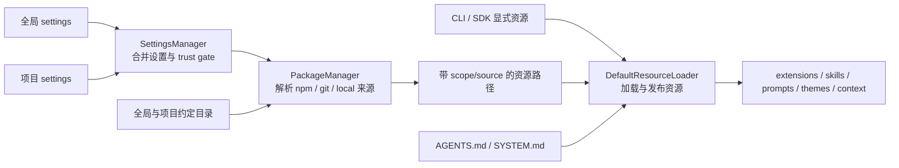

# 设置、Package 与资源解析链

来源：`settings.md`、`packages.md`、`usage.md`、`security.md` 和 `sdk.md`，并核对 `settings-manager.ts`、`package-manager.ts` 与 `resource-loader.ts`。排除安装命令、配置字段全集、package 制作步骤和资源编写教程。

## 1. 三个组件不是同一层

`SettingsManager` 决定当前有效设置；`PackageManager` 同时解析设置中的 package source 和全局/项目约定目录，产生带来源与启用状态的路径；`DefaultResourceLoader` 再合并这些路径与 CLI/SDK 显式输入，并加载具体内容。package 不是第五种运行时扩展，它只是 extensions、skills、prompts 和 themes 的分发容器。

## 2. 全局与项目设置先经过信任边界

全局 settings 对所有项目生效。项目 `.pi/settings.json` 只有在当前 cwd 被信任后才参与合并；未信任时不是“读取后忽略危险字段”，而是整个项目设置与受保护项目资源不进入有效配置。嵌套配置通常深度合并，但资源数组和少数产品字段有各自覆盖规则，不能假设所有数组都会拼接。

交互模式可以向用户询问信任；print、JSON 和 RPC 等非交互模式不能弹窗，只能依据已保存决定、全局 fallback 或本次显式 override。trust 控制是否加载项目输入，不限制加载后的代码权限。扩展一旦执行，仍拥有宿主进程权限。

## 3. PackageManager 解决来源，ResourceLoader 解决内容

`PackageManager` 理解 npm、git 和本地路径，负责 scope、安装位置、package 身份、manifest/约定目录和过滤。它的输出不是已经执行的扩展，而是带 `source`、`scope`、`origin` 与 enabled 状态的路径。

`DefaultResourceLoader` 再读取这些路径：extension 路径交给代码 loader，skill 与 prompt 路径交给 Markdown loader，theme 路径交给 theme loader。分开后，资源发现与资源语义不会混在 package 下载代码里；SDK 也能绕过默认 package manager，直接注入资源路径、factory 或自定义 loader。

## 4. Scope、过滤和冲突是三件事

- scope 表示资源来自 user、project 或 temporary。
- filter 表示一个 package 中哪些资源被允许进入候选集合。
- collision 表示多个候选最终具有同一资源名称时谁生效。

同一 package 同时出现在全局与项目配置时，先按规范化身份去重；npm 使用 package name，git 使用不含 ref 的仓库 URL，本地来源使用绝对路径。项目配置通常覆盖全局条目；`autoload: false` 则让项目条目作为对全局条目的显式增减。package 内的 filter 只能在 manifest 或约定目录允许的集合上继续缩小，不能用 filter 越权读取任意路径。

解析后的资源还按来源优先级排序。当前 `PackageManager` 对顶层项目设置、项目自动发现、顶层用户设置、用户自动发现和 package 资源分配不同优先级，使后续“同名 first wins”得到稳定结果。诊断信息保留来源元数据，UI 才能说明资源来自哪里以及为何冲突。

## 5. Context file 与可执行扩展的信任级别不同

`AGENTS.md`、`CLAUDE.md`、skills 和 prompt templates 最终影响模型输入；extension 则直接在 Node 进程执行。它们都由 ResourceLoader 汇总，但加载方式和风险不同。项目尚未信任时可以读取 context file 作为指令来源，同时禁止项目 extension 和项目 package 代码参与 trust 决策，避免待审批代码批准自身。

context file 按全局、祖先目录到当前目录的顺序叠加；同一目录的 `AGENTS.override.md` 替代该目录的普通候选。SYSTEM/APPEND_SYSTEM、context files 和 skills 参与基础 system prompt 构建；prompt template 不进入 system prompt，只在用户显式输入对应斜杠命令时展开到 user message。它们不是 SettingsManager 的字段合并结果。

## 6. reload 为什么要重新走解析链

reload 不只是重新执行 extension 文件。设置可能改变 package 集合、过滤规则和资源路径；package 解析结果可能改变来源元数据；theme、skill、prompt、context file 与 extension cache 都可能需要更新。因此默认 loader 重新收集候选、解析冲突并发布新的资源集合，`AgentSession` 再重新绑定 extension runtime 和模型可见资源。

session 切换到不同 cwd 时同样需要重建这些服务，因为项目 settings、trust、package scope 和祖先 context files 都可能不同。仅替换 `Agent.messages` 无法得到正确的新项目环境。

## 7. 具体实现

1. 读 [`settings-manager.ts`](../../packages/coding-agent/src/core/settings-manager.ts)，确认全局、项目与运行时设置怎样合并。
2. 读 [`package-manager.ts`](../../packages/coding-agent/src/core/package-manager.ts)，确认 package 来源、scope、过滤与优先级。
3. 读 [`resource-loader.ts`](../../packages/coding-agent/src/core/resource-loader.ts) 的 `reload()`，确认最终资源集合怎样发布。
4. 读 [`cli/project-trust.ts`](../../packages/coding-agent/src/cli/project-trust.ts) 与 [`core/project-trust.ts`](../../packages/coding-agent/src/core/project-trust.ts)，确认 trust 决策怎样发生在受保护资源加载之前。
